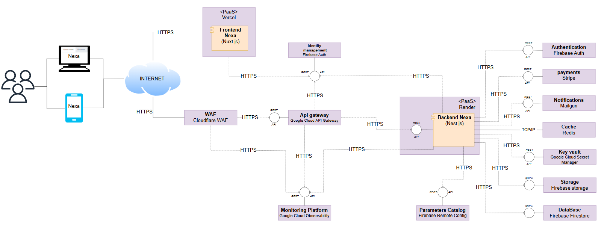
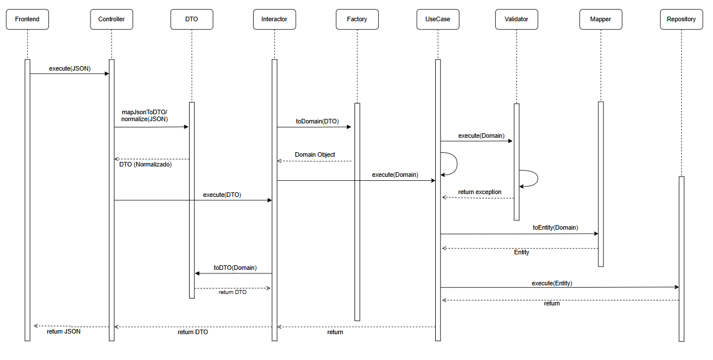
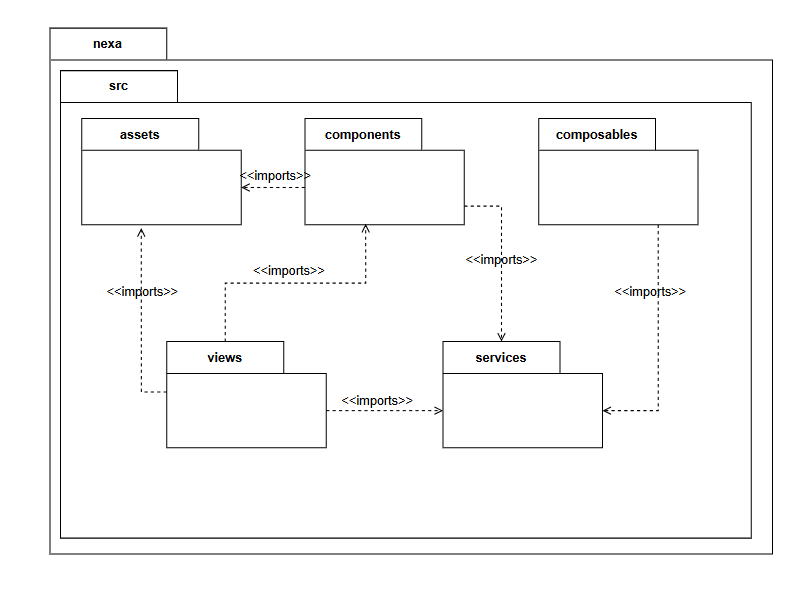
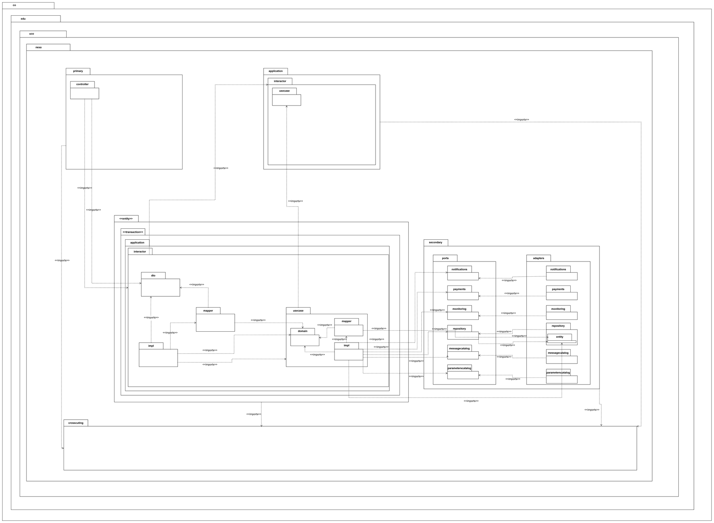
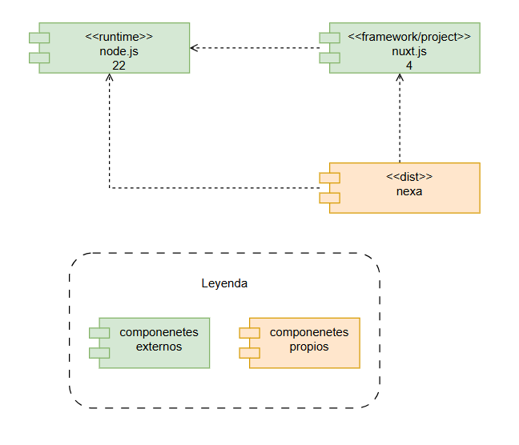
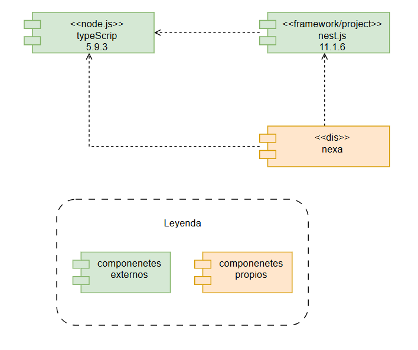

# Documento de Arquitectura de Software (DAS)

[📖 Ir al README](./README.md)

**Proyecto**  
Nexa

**Arquitectos**  
Maicol Oviedo Quintero

## Índice

1. [Información General](#info-general)
2. [Restricciones Técnicas](#restricciones-tecnicas)  
3. [Restricciones de Negocio](#restricciones-negocio)
4. [Atributos de Calidad](#atributos-calidad)
5. [Funcionalidades Críticas](#funcionalidades-criticas)
6. [Componentes](#componentes-seccion)
7. [Implementación](#implementacion-seccion)
8. [Componentes Adoptados](#componentes-adoptados-seccion)
9. [Componentes Desarrollados](#componentes-desarrollados-seccion)
10. [Motivadores](#motivadores-seccion)
11. [Arquetipo](#arquetipo-seccion)
12. [Arquitectura](#arquitectura-seccion)
13. [Línea Base](#linea-base-seccion)
14. [Vistas](#vistas-seccion)
    - [Componentes Backend](#componentes-backend)
    - [Componentes Frontend](#componentes-frontend)
    - [Paquetes Back/Front](#paquetes-backfront)
    - [Diagrama de Secuencia](#secuencia-diagrama)
15. [Justificación](#justificacion-seccion)

## Navegación por contenido

- [Información General](#info-general)
- [Restricciones Técnicas](#restricciones-tecnicas)
- [Restricciones de Negocio](#restricciones-negocio)
- [Atributos de Calidad](#atributos-calidad)
- [Funcionalidades Críticas](#funcionalidades-criticas)

### Diagramas y Diseño
- [Componentes](#componentes-seccion)
- [Arquetipo](#arquetipo-seccion)
- [Arquitectura](#arquitectura-seccion)

### Vistas del Sistema
- [Vista de Componentes Back](#componentes-backend)
- [Vista de Componentes Front](#componentes-frontend)
- [Vista de Paquetes](#paquetes-backfront)
- [Vista de Secuencia](#secuencia-diagrama)

### Detalles Técnicos
- [Implementación](#implementacion-seccion)
- [Componentes Adoptados](#componentes-adoptados-seccion)
- [Componentes Desarrollados](#componentes-desarrollados-seccion)
- [Línea Base](#linea-base-seccion)
- [Justificación](#justificacion-seccion)

## Índice

1. [Información General](#info-general)
2. [Restricciones Técnicas](#restricciones-tecnicas) 
3. [Restricciones de Negocio](#restricciones-negocio)
4. [Atributos de Calidad](#atributos-calidad)
5. [Funcionalidades Críticas](#funcionalidades-criticas)
6. [Componentes](#componentes)
7. [Implementación](#implementacion)
8. [Componentes Adoptados](#componentes-adoptados)
9. [Componentes Desarrollados](#componentes-desarrollados)
10. [Motivadores](#motivadores)
11. [Arquetipo](#arquetipo)
12. [Arquitectura](#arquitectura)
13. [Línea Base](#linea-base)
14. [Vistas](#vistas)
    - [Componentes Backend](#componentes-back)
    - [Componentes Frontend](#componentes-front)
    - [Paquetes Back/Front](#paquetes-back-front)
    - [Diagrama de Secuencia](#secuencia)
15. [Justificación](#justificacion) 

- [1. Información General](#1-información-general)
  - [Control de cambios y revisiones](#control-de-cambios-y-revisiones)
  - [Propósito del proyecto](#propósito-del-proyecto)
- [2. Motivadores de la Arquitectura](#2-motivadores-de-la-arquitectura)
  - [2.1 Restricciones Técnicas](#21-restricciones-técnicas)
  - [2.2 Restricciones de Negocio](#22-restricciones-de-negocio) 
  - [2.3 Atributos de Calidad](#23-atributos-de-calidad)
    - [Disponibilidad](#disponibilidad)
    - [Confiabilidad](#confiabilidad)
    - [Rendimiento](#rendimiento)
    - [Seguridad](#seguridad)
  - [2.4 Funcionalidades Críticas](#24-funcionalidades-críticas)
- [3. Arquetipo de Solución](#3-arquetipo-de-solución)
- [4. Arquitectura de Solución](#4-arquitectura-de-solución)
- [5. Línea Base Arquitectónica](#5-línea-base-arquitectónica)
  - [Componentes Adoptados](#componentes-adoptados)
  - [Componentes Desarrollados](#componentes-desarrollados)
- [6. Justificación de la Solución](#6-justificación-de-la-solución)
  - [Ventajas](#ventajas)

---

## Navegación por contenido

- [Información General](#info-general)
- [Restricciones Técnicas](#restricciones-tecnicas)
- [Restricciones de Negocio](#restricciones-negocio)
- [Atributos de Calidad](#atributos-calidad)
- [Funcionalidades Críticas](#funcionalidades-criticas)

### Diagramas y Diseño
- [Componentes](#componentes)
- [Arquetipo](#arquetipo)
- [Arquitectura](#arquitectura)

### Vistas del Sistema
- [Vista de Componentes Back](#componentes-back)
- [Vista de Componentes Front](#componentes-front)
- [Vista de Paquetes](#paquetes-back-front)
- [Vista de Secuencia](#secuencia)

### Detalles Técnicos
- [Implementación](#implementacion)
- [Componentes Adoptados](#componentes-adoptados)
- [Componentes Desarrollados](#componentes-desarrollados)
- [Línea Base](#linea-base)
- [Justificación](#justificacion)

## 1. Información General

### Control de cambios y revisiones

| Versión | Fecha | Autor | Descripción de cambios |
|---------|-------|-------|------------------------|
| 1.0    | 11/2025 | Maicol Oviedo Quintero | Versión inicial del documento. |

## 1. Propósito del proyecto

Para Emprendedores y pequeños negocios que venden productos (ropa, accesorios, belleza, etc.) por redes sociales y desean digitalizar su tienda sin conocimientos técnicos. Que necesitan organizar su catálogo, pedidos e inventario de forma sencilla y profesional sin depender de hojas de cálculo o mensajes dispersos. Además no tienen claridad sobre sus ventas, productos más vendidos ni el crecimiento del negocio, porque todo se maneja de forma manual. Nexa es una Plataforma web que ofrece organización profesional, gestión de pedidos y visibilidad clara del rendimiento del negocio. Facilita la creación de una tienda online profesional en minutos, permitiendo a los negocios vender de forma más organizada, automatizada y escalable. A diferencia de muchos negocios que utilizan cuadernos, hojas de cálculo o simplemente memoria para llevar el control de productos y ventas. Algunos usan apps como Excel, Shopify o Tiendanube, pero no están optimizadas para usuarios sin conocimientos técnicos o con necesidades simples. Estas herramientas suelen ser complejas, poco intuitivas o demasiado costosas para negocios que están comenzando. Nuestro producto es una plataforma simple e intuitiva, diseñada para emprendedores y pequeños negocios que venden principalmente a través de redes sociales. Pensada para usuarios sin experiencia técnica, permite crear una tienda online funcional en minutos, con control de stock y estadísticas claras de ventas. A precios accesibles y sin complicaciones técnicas, la plataforma integra fácilmente canales como WhatsApp, convirtiendo la venta informal en una operación más profesional, organizada y escalable.

## 2. Motivadores de la arquitectura

Los motivadores de la arquitectura son los factores clave que guían el diseño y desarrollo del proyecto, asegurando que la solución cumpla con las necesidades técnicas, de negocio y de calidad.

### 2.1 Restricciones Técnicas

Las restricciones técnicas son limitaciones impuestas por el entorno tecnológico, como hardware, software o estándares, que impactan el diseño. A continuación, se listan las restricciones técnicas identificadas, con su tipo y justificación:

| Tipo | Restricción | Justificación |
|------|-------------|---------------|
| Diseño | Se debe propender por la aplicación de prácticas basadas en Clean Architecture. | Reduce costos de mantenimiento y evolución. La modularidad permite añadir nuevas funcionalidades (Ej. Agregar metodos de pago) o actualizar integraciones (Ej. WhatsApp API) rápidamente, asegurando que Nexa sea competitiva y adaptable. Asi se pueden generar mejoras para el cliente de manera fácil y segura. |
| Implementación | Se debe propender por la aplicación de prácticas relacionadas con Clean Code. | Aumenta la calidad y reduce errores en producción. Un código legible permite corregir bugs rápidamente mejorando la experiencia de los clientes. |
| Diseño | Se debe propender por la aplicación de patrones de diseño que promuevan un diseño con bajo acoplamiento y alta cohesión. | Un diseño con bajo acoplamiento nos permite modificar un componente de la aplicación sin afectar a otros. La alta cohesión asegura que las funcionalidades relacionadas estén agrupadas, lo que hace el código más modular, escalable y robusto para el futuro. |
| Implementación | Se debe propender por la adopción de la metodología de desarrollo eXtreme Programming, o al menos gran cantidad de las prácticas más recomendadas. | Es importante para Nexa porque permite al cliente recibir nuevas funcionalidades rápidamente y con alta calidad, como mejoras en la búsqueda de productos o la gestión de suscripciones, sin comprometer la estabilidad. Prácticas como TDD aseguran que funcionalidades críticas, estén libres de errores. Esto garantiza que Nexa evolucione rápidamente para satisfacer las necesidades del mercado, aumentando la satisfacción de los usuarios y acelerando el retorno de inversión. |
| Implementación | Se debe propender por la adopción de prácticas de DevOps, relacionadas con las estrategias de integración continua, entrega continua y despliegue continuo. | La adopción de prácticas DevOps —como integración continua, entrega continua y despliegue continuo— permite que Nexa evolucione de forma rápida, confiable y sin interrupciones visibles para el usuario. Esto se traduce en actualizaciones frecuentes, corrección de errores sin afectar la operación y una experiencia estable incluso mientras el producto mejora. Para el cliente, significa contar con una plataforma que siempre está disponible, actualizada y alineada con sus necesidades reales, sin tiempos muertos ni procesos manuales que generen incertidumbre. |
| Diseño | Se debe propender por la adopción de bloques de construcción que promuevan aceleradores dentro del desarrollo del producto. | La adopción de bloques de construcción reutilizables permite acelerar el desarrollo de nuevas funcionalidades sin comprometer la calidad ni la estabilidad del sistema. Para el cliente, esto se traduce en mejoras visibles en menos tiempo, una evolución constante del producto y una experiencia más fluida, sin demoras innecesarias ni interrupciones. |
| Diseño | Se debe propender por construcción aplicaciones de naturaleza Cloud Enabled o Cloud Native. | Construir Nexa como una aplicación Cloud Enabled o Cloud Native permite aprovechar al máximo las capacidades de Firebase, como escalabilidad automática, alta disponibilidad y servicios integrados. Esto garantiza que la plataforma funcione de forma fluida, sin interrupciones, incluso ante picos de uso o expansión multitienda. Para el cliente, significa contar con una solución confiable, siempre disponible y preparada para crecer sin necesidad de reestructuraciones técnicas. |
| Diseño | Se debe propender por la construcción de aplicaciones que sigan los principios del manifiesto reactivo. | Construir Nexa siguiendo los principios del manifiesto reactivo permite que la plataforma sea responsiva, resiliente, elástica y orientada a mensajes. Esto garantiza que el sistema responda rápidamente, se recupere ante fallos sin afectar al usuario, se adapte a variaciones en la carga y mantenga una comunicación fluida entre módulos. Para el cliente, esto se traduce en una experiencia confiable, continua y ágil, incluso en escenarios de alta demanda o condiciones inesperadas. |
| Implementación | Se debe propender por la construcción de aplicaciones que sigan las prácticas definidas en los 12 factores de aplicación más los 3 extendidos. | Seguir las prácticas de los 12 factores (más los 3 extendidos) ayuda a que Nexa sea más ordenada, escalable y fácil de mantener. Esto permite que la app funcione bien en la nube, se actualice sin complicaciones y se adapte a nuevas necesidades sin romper lo que ya existe. Para el cliente, significa tener una plataforma confiable, que mejora constantemente y que no se cae ni se vuelve lenta cuando crece. |
| Diseño | Se debe propender por la arquitectura de sistemas nativos para la nube basados en los pilares fundamentales del Well Architected Framework. | Permite construir una plataforma confiable, segura, eficiente y preparada para crecer. Esto significa que el sistema estará siempre disponible, se recuperará ante fallos, usará los recursos de forma inteligente y protegerá los datos del cliente. Para el usuario final, se traduce en una experiencia estable, rápida y segura, incluso cuando la demanda aumenta o el producto evoluciona. |
| Diseño | Se debe propender por la arquitectura de un sistema nativo para la nube basado en las prácticas definidas dentro del Cloud Adoption Framework. | Seguir las prácticas del Cloud Adoption Framework permite que Nexa no solo esté bien construida técnicamente, sino que evolucione de forma alineada con los objetivos del negocio, la cultura del equipo y las necesidades reales del cliente. Este marco guía desde la estrategia hasta la operación, ayudando a tomar decisiones claras sobre gobernanza, seguridad, estructura organizativa y gestión del cambio. Para el cliente, esto se traduce en una plataforma que no solo funciona bien, sino que está pensada para crecer de forma sostenible, con procesos claros y decisiones coherentes. |
| Metodológico | Se debe propender por la aplicación de metodologías ágiles. | Las metodologías ágiles, como Scrum, nos permiten ser flexibles y responder rápidamente a los cambios del mercado. Al trabajar en ciclos cortos (sprints), podemos entregar valor a los emprendedores de Nexa de manera constante y ajustar el producto en función de su feedback. |
| Diseño | Se debe propender por la documentación de APIs y módulos, usando el principio code as documentation. | Es fundamental para Nexa porque permite al cliente mantener una plataforma fácil de actualizar y escalar, reduciendo costos y tiempos de desarrollo. Por ejemplo, una API bien documentada asegura que los desarrolladores integren nuevos servicios rápidamente sin errores, mientras que un código autoexplicativo (siguiendo Clean Code) minimiza la necesidad de manuales extensos para módulos. Esto garantiza que los vendedores disfruten de una plataforma estable y que el cliente incorpore nuevos desarrolladores o socios externos sin retrasos, manteniendo competitividad y continuidad. |

### 2.2 Restricciones de Negocio

Las restricciones de negocio son limitaciones derivadas de objetivos comerciales, presupuestos o regulaciones. A continuación, se listan las restricciones de negocio identificadas, con su tipo, importancia, riesgos y planes de acción:

| Tipo | Restricción | Importancia para el proyecto | Riesgo | Plan Acción |
|------|-------------|------------------------------|--------|-------------|
| Humano | La product owner no posee un par que pueda atender sus asuntos en caso de alguna contingencia o eventualidad que ocasionen algún tema que le obligue la no participación dentro del proyecto. | Alta. La ausencia del product owner sin respaldo puede detener decisiones clave y validaciones importantes para el avance del proyecto. | Retraso del proyecto; Fracaso del proyecto | Se debe garantizar que siempre se tenga al menos un respaldo para el product Owner. Se debe establecer un plan de acción claro para evitar el fracaso del proyecto, incluyendo respaldo para roles críticos, revisión constante de prioridades, y entregables validados en ciclos cortos. |
| Humano | En varias ocasiones se ha identificado que no es posible que las personas que conocen del negocio participen en sesiones clave de definición del alcance, lo que ha llevado a que personas que no son expertas en el proceso, tomen decisiones que luego son refutadas por los actores principales y conocedores, generando reprocesos. | Decisiones incorrectas generan retrabajo y confusión. | Retraso del proyecto; Reprocesos | Asegurar la participación de expertos clave en todas las sesiones críticas y validar decisiones mediante actas. Se debe documentar y validar cada decisión funcional con los actores del negocio antes de iniciar su implementación, asegurando que las definiciones estén claras, aprobadas y disponibles para consulta por todo el equipo. |
| Humano | El product owner asignado al proyecto no tiene el tiempo de dedicación necesario a causa de otras responsabilidades y actividades del día a día que le consumen su agenda, lo que entonces hace que no se puedan atender sesiones clave del proyecto para aclarar y definir aspectos que permitan avanzar con el desarrollo y cumplir de esta manera con el tiempo acordado. | Sin participación activa, se pierde validación de escenarios, claridad en decisiones y alineación con el negocio, se retrasa el proyecto. | Retraso del proyecto; Fracaso del proyecto; Reprocesos | Definir horarios de disponibilidad obligatorios, priorizar reuniones críticas y considerar apoyo de un co-product owner o asistente técnico. Se debe establecer un mecanismo de seguimiento semanal con responsables clave, donde se revisen avances reales, bloqueos y decisiones pendientes, asegurando que todo el equipo esté alineado y que los entregables mantengan utilidad perceptible para el negocio. Toda definición funcional debe quedar documentada y validada por los actores del negocio antes de iniciar su implementación, asegurando trazabilidad y evitando ajustes posteriores por falta de alineación. |
| Presupuesto | El proyecto tiene un presupuesto de $2000.000 para el desarrollo, puesta en producción, mantenimiento y soporte del producto por el siguiente año. | Si no se definen criterios claros de asignación, seguimiento y priorización, el presupuesto puede diluirse en tareas no esenciales, comprometiendo entregables clave y afectando la sostenibilidad del producto. | Fracaso del proyecto | Se debe aclarar un alcance realista y que le brinde valor al producto para no gastar recursos en funcionalidades poco importantes o innecesarias. Sin una definición clara y validada del alcance, se corre el riesgo de invertir tiempo y presupuesto en desarrollos que no aportan valor perceptible al negocio ni al usuario final. |
| Presupuesto | El proyecto aunque tiene los recursos necesarios para el desarrollo, irá desembolsando el valor de acuerdo a los avances e hitos cumplidos a satisfacción por el cliente, aún sabiendo, la gran incertidumbre, respecto a la definición del producto deseado. | Riesgo de retraso por indecisión del cliente. | Fracaso del proyecto | Definir entregables claros y aceptación formal por cada hito. Mantener comunicación constante con el cliente. |
| Procesos | El cliente no tiene un proceso claramente definido, y aun así, ha insistido en avanzar en victorias tempranas, construyendo los aspectos que vaya definiendo sobre el camino. | Cuando no hay una base clara del proceso, cada decisión se vuelve tentativa y cada funcionalidad corre el riesgo de quedar mal alineada. En Nexa, donde buscamos que cada módulo tenga lógica perceptible y utilidad real, avanzar sin esa claridad puede llevar a construir cosas que luego hay que desmontar o rehacer. | Reprocesos; Retraso del proyecto | Documentar procesos mínimos necesarios, establecer un flujo de aprobación antes de avanzar. Además, se deben establecer entregables acotados que puedan ajustarse sin afectar lo ya construido, evitando así retrabajos innecesarios. Para evitar retrasos, se debe acordar con el cliente que cada nueva definición se valide antes de desarrollarla. Las victorias tempranas deben construirse sobre entregables pequeños y flexibles, que puedan ajustarse sin afectar lo ya avanzado. Esto mantiene el ritmo sin comprometer la estabilidad del proyecto. |
| Procesos | El cliente espera que TI sea un actor clave responsable de la definición del proceso de negocio, cuando no es su responsabilidad, dado que TI habilita procesos de negocio y no los define. | Confusión de roles puede generar reprocesos y mal diseño del sistema. | Reprocesos; Fracaso del proyecto; Retraso del proyecto; Malas definiciones | Se debe aclarar desde el inicio que TI no define procesos de negocio, sino que los habilita. Toda decisión funcional debe venir validada por los responsables del negocio, y TI solo la traduce en soluciones tecnológicas. Esto evita malentendidos y ajustes posteriores por definiciones incorrectas. Para que el proyecto no se descarrile, es clave dejar claro desde el principio que TI no define cómo debe funcionar el negocio. Esa responsabilidad es del cliente. TI está para convertir esas decisiones en soluciones tecnológicas, no para inventarlas. Si eso no se aclara, se corre el riesgo de construir cosas que luego no sirven. Para evitar malas definiciones, hay que dejar claro desde el principio que TI no decide cómo debe funcionar el negocio. Esa parte le corresponde al cliente. Si no se define bien desde el lado funcional, TI termina construyendo sobre suposiciones, y eso casi siempre lleva a ajustes, reprocesos o entregables que no sirven. |
| Procesos | Se debe asegurar el cumplimiento de la normatividad colombiana vigente en materia de comercio electrónico, protección al consumidor y tributación digital, especialmente en lo relacionado con el cobro de suscripciones en plataformas SaaS. | Afecta directamente los flujos de pago de suscripciones, que deben contemplar reglas legales específicas y trazabilidad completa. | Retraso del proyecto | Incluir revisión legal periódica, asignar responsable de cumplimiento normativo y realizar auditorías internas de avance. |

### 2.3 Atributos de Calidad

Los atributos de calidad definen las características no funcionales como rendimiento, usabilidad, etc. A continuación, se detallan los atributos identificados, con sus características y escenarios de calidad.

#### 2.3.1 Disponibilidad

##### 2.3.1.1 Disponibilidad continua para acceso en cualquier momento

| Identificador | Nombre | Tipo | Objetivo | Descripción | Criterio éxito | Fuente del estímulo | Estímulo | Ambiente | Artefacto | Respuesta | Medida de la respuesta | ¿Cumplió? |
|---------------|--------|------|----------|-------------|---------------|---------------------|----------|----------|-----------|-----------|------------------------|-----------|
| ESC-CAL-Disponibilidad-0001 | Acceso exitoso a la tienda en cualquier momento. | Flujo básico | Garantizar que la tienda esté disponible para cualquier usuario en todo momento. | Escenario que permite verificar que cuando un usuario intente ingresar a la plataforma se puede acceder en cualquier momento sin interrupciones. | El usuario final intenta ingresar a la plataforma y esta esta accesible y responde correctamente en al menos el 95% de los intentos de acceso mensuales. | Cualquier usuario que haga uso de la plataforma. | Cualquier usuario, intenta acceder y navegar por la plataforma en cualquier momento. | Operación normal | Sistema | El sistema direcciona al usuario a la página principal donde le muestra las opciones disponibles de acuerdo al rol que posee. | El usuario ha podido acceder a la tienda de forma exitosa y sin demoras. La tienda ha cargado correctamente en al menos el 95% de los intentos de acceso mensuales. | No |
| ESC-CAL-Disponibilidad-0002 | El usuario intenta acceder y percibe una interrupción. | Flujo alterno | Verificar tolerancia a interrupciones breves. | Escenario que permite evaluar cómo la tienda responde a interrupciones temporales del servicio. | El usuario final intenta ingresar a la plataforma y esta esta inaccesible. Las interrupciones no deben ocurrir en más del 5% de los intentos de acceso mensuales | Cualquier usuario que haga uso de la plataforma. | Un usuario intenta acceder a la plataforma mientras presenta una falla o está en mantenimiento. | Operación normal | Sistema | El sistema muestra un mensaje claro y amigable de que la página no se encuentra disponible en el momento. | El usuario recibe una respuesta del sistema que indica la indisponibilidad temporal, en lugar de un error de conexión o una página en blanco. Esto ocurre en un máximo del 5% de los intentos de acceso mensuales. | No |

#### 2.3.2 Confiabilidad

##### 2.3.2.1 Conservación estable y coherente de la información registrada

| Identificador | Nombre | Tipo | Objetivo | Descripción | Criterio éxito | Fuente del estímulo | Estímulo | Ambiente | Artefacto | Respuesta | Medida de la respuesta | ¿Cumplió? |
|---------------|--------|------|----------|-------------|---------------|---------------------|----------|----------|-----------|-----------|------------------------|-----------|
| ESC-CAL-Confiabilidad-0003 | El usuario espera que toda la información que gestiona se mantenga intacta, sin alteraciones inesperadas. | Flujo básico | Garantizar que la información registrada por el usuario permanezca íntegra y sin alteraciones. | Escenario que permite Garantizar que la información registrada en la aplicación se conserve de forma estable, coherente y sin alteraciones inesperadas | Toda la información registrada permanece intacta y coherente en todas las consultas y visualizaciones posteriores a su gestión. | Cualquier usuario que interactúa con la aplicación. | El usuario accede a la aplicación y revisa la información previamente registrada. | Operación normal | Sistema | La aplicación conserva la información registrada de forma íntegra y estable, sin alteraciones, pérdidas ni inconsistencias inesperadas. | El usuario accede a la aplicación en cualquier momento y revisa la información que había gestionado previamente. Al hacerlo, confirma que todo permanece igual, sin cambios inesperados, errores ni pérdidas. | No |

#### 2.3.3 Rendimiento

##### 2.3.3.1 Rendimiento general y navegación fluida de la aplicación

| Identificador | Nombre | Tipo | Objetivo | Descripción | Criterio éxito | Fuente del estímulo | Estímulo | Ambiente | Artefacto | Respuesta | Medida de la respuesta | ¿Cumplió? |
|---------------|--------|------|----------|-------------|---------------|---------------------|----------|----------|-----------|-----------|------------------------|-----------|
| ESC-CAL-Rendimiento-0004 | Rendimiento general y navegación fluida de la aplicación | Flujo básico | Garantizar que todas las acciones del usuario se ejecuten de forma inmediata y fluida | Escenario que permite verificar que cada acción que realiza el usuario se ejecute dentro de los tiempos óptimos definidos por la tabla de rendimiento de Nexa. | Todas las acciones se ejecutan dentro de los tiempos óptimos de respuesta establecidos | Cualquier usuario que interactúa con la aplicación. | El usuario realiza cualquier acción dentro de la plataforma | Operación normal | Sistema | La aplicación responde de forma inmediata a cada acción, sin bloqueos ni retrasos perceptibles | Cada acción realizada por el usuario se completa dentro de los tiempos definidos como óptimos en la tabla de rendimiento de Nexa, sin demoras ni interrupciones. | No |

#### 2.3.4 Seguridad

##### 2.3.4.1 Se requiere que el sistema restrinja las acciones según el rol asignado a cada usuario

| Identificador | Nombre | Tipo | Objetivo | Descripción | Criterio éxito | Fuente del estímulo | Estímulo | Ambiente | Artefacto | Respuesta | Medida de la respuesta | ¿Cumplió? |
|---------------|--------|------|----------|-------------|---------------|---------------------|----------|----------|-----------|-----------|------------------------|-----------|
| ESC-CAL-Seguridad-0005 | Acceso a acciones o modulos permitidos según rol | Flujo básico | Asegurar que un usuario solo pueda acceder a lo que su rol permite | Escenario que permite garantizar que cuando un usuario ingrese el sistema muestre y permita únicamente las funciones y recursos permitidos según el rol asignado al usuario | El usuario no puede ver ni ejecutar funciones fuera de su rol. La navegación se mantiene dentro de los límites definidos. | Cualquier usuario que haga uso de la plataforma | El usuario interactúa con la aplicación según su rol asignado y accede a las acciones permitadas según el mismo | Operación normal | Sistema | La aplicación muestra solo las funciones permitidas para ese rol, sin exponer accesos indebidos | El usuario final logra ejecutar la acción permitida por su rol, el sistema solo muestra las acciones permitidas según su rol evitando confusiones. El acceso se restringe correctamente | No |
| ESC-CAL-Seguridad-0006 | Intento de acceso a acciones o modulos no permitidos. | Flujo alterno | Asegurar que un usuario no pueda realizar acciones no permitidas según su rol | Escenario que permite garantizar que cuando un usuario ingrese el sistema intenta acceder a funciones y recursos no permitidos según el rol asignado al usuario | El usuario final intenta acceder a recursos o intenta realizar cualquier funcion no autorizado para su rol por lo que el sistema impide el acceso y comunica que la función no está disponible para ese tipo de usuario. | Cualquier usuario que haga uso de la plataforma | El usuario solicita acceso a una función no permitida para su rol | Operación normal | Sistema | La aplicación bloquea el intento y muestra un mensaje explicando la restricción por rol | El usuario final no logra ejecutar la acción fuera de su rol se bloquea la acción de forma inmediata. El acceso se restringe correctamente | No |

##### 2.3.4.2 Se requiere que al usuario ingresar a la aplicación desde un nuevo dispositivo sea mediante un proceso con doble factor de autenticación

| Identificador | Nombre | Tipo | Objetivo | Descripción | Criterio éxito | Fuente del estímulo | Estímulo | Ambiente | Artefacto | Respuesta | Medida de la respuesta | ¿Cumplió? |
|---------------|--------|------|----------|-------------|---------------|---------------------|----------|----------|-----------|-----------|------------------------|-----------|
| ESC-CAL-Seguridad-0007 | Ingreso a la aplicación desde un nuevo dispositivo con un doble factor de autenticación válido dentro del tiempo de vigencia del código | Flujo básico | Asegurar que un usuario que intenta acceder desde un nuevo dispositivo pueda ingresar a la aplicación con un doble factor de autenticación válido | Escenario que permite garantizar que cuando un usuario ingrese desde un nuevo dispositivo despues de diligenciar de manera correcta su nombre de usuario y clave válida, le sea enviado a su correo electrónico o celular un segundo factor de autenticación, el cual procederá a registrar dentro del sitio dentro del tiempo límite permitido, antes de que el código haya vencido. | El usuario que intenta acceder desde un nuevo dispositivo ha registrado de forma exitosa el código enviado a su correo electrónico dentro del tiempo límite de vigencia permitido, logrando de esta manera que la aplicación le permita su ingreso y lo lleve a la página principal donde le muestra las opciones disponibles de acuerdo al rol que posee. | Cualquier usuario que haga uso de los servicios autenticados de la aplicación | El usuario ha digitado correctamente un código que le fue enviado al correo electrónico como doble factor de autenticación dentro del tiempo de vigencia del mismo y ha ejecutado la acción ingresar | Operación normal | Sistema | El sistema lo direcciona a la página principal donde le muestra las opciones disponibles de acuerdo al rol que posee. | El usuario que intenta acceder desde un nuevo dispositivo se le ha solicitado un doble factor de autenticación para poder ingresar a la aplicación y al final ha podido ingresar a la aplicación de forma exitosa, luego de haber registrado el código que le fue enviado a su correo electrónico o celular dentro del tiempo de vigencia de este. | No |

### 2.4 Funcionalidades críticas

Las funcionalidades críticas son las operaciones esenciales con restricciones funcionales. A continuación, se listan con su tipo, descripción y tácticas/estrategias:

| Tipo de funcionalidad crítica | Tipo especificación funcionalidad crítica | Descripción | Táctica/Estrategia (Nombre táctica) | Descripción estrategia |
|-------------------------------|-------------------------------------------|-------------|-------------------------------------|------------------------|
| Reto técnico | Requerimiento funcional | REQ-FUN-001 - El sistema debe permitir válidar la que la dirección de correo electronico si exista y le pertenesca al usuario, debe enviar un código de verificación al correo electrónico, para habilitar el acceso a la plataforma. | Implementación de Firebase Auth | Firebase Auth garantiza que los usuarios puedan registrarse y verificar su cuenta de manera segura, rápida y confiable. Esto delega la complejidad de la gestión de usuarios y la seguridad de contraseñas a una plataforma especializada, permitiendo que el desarrollo se enfoque en la lógica de negocio de Nexa. Un plus es que nexa va a usar servicio de storage ne firebase. |
| Reto técnico | Requerimiento funcional | REQ-FUN-002 - El sistema debe detectar automáticamente cuando un usuario no ha realizado el pago de su suscripción en la fecha límite establecida. | Integración con el sdk de Stripe para suscripciones | Se integra Stripe Billing para gestionar las suscripciones de los usuarios. Stripe notifica automáticamente al sistema cuando un pago falla o expira. Esta estrategia garantiza automatización total, seguridad en los pagos y protección del modelo de negocio, sin necesidad de verificar manualmente cada transacción. |
| Impacto o promesa de valor para el negocio | Requerimiento funcional | REQ-FUN-003 - El sistema debe cambiar el estado de todas las tiendas pertenecientes a un usuario de acuerdo al estado de su suscripción. | Manejo de estados en base de datos/ sdk Stripe | De acuerdo al estado de la suscripción de un usuario se debe poder actualizar el estado de sus tiendas asociadas en la base de datos. |
| Impacto o promesa de valor para el negocio | Requerimiento funcional | REQ-FUN-004 - El usuario debe recibir una notificación automática por correo electrónico, que informe la causa de la suspensión de su cuenta. | Integración con la API de Mailgun | Se utilizará la API de Mailgun en el backend para enviar correos electrónicos de forma programática. Cuando se active la lógica de suspensión, el sistema de Nexa invocará la API de Mailgun con los datos del usuario. El correo contendrá un mensaje predefinido que explicará la razón del impago y las instrucciones claras para reactivar la suscripción. |
| Impacto o promesa de valor para el negocio | Requerimiento funcional | REQ-FUN-005 - El sistema debe permitir que un usuario pueda reactivar su suscripción manualmente a través de un proceso de pago iniciado en la sección "Suscripción". | Integración de Flujo de Pago con Stripe | Se implementará un flujo de pago con el SDK de Stripe que, al seleccionar un plan gestiona todo el proceso. Esto simplifica el proceso de compra y delega a Stripe la responsabilidad de manejar los datos sensibles de la tarjeta y la confirmación del pago. Al completarse exitosamente, Stripe enviara una confirmación para activar la lógica de reactivación. |
| Impacto o promesa de valor para el negocio | Requerimiento funcional | REQ-FUN-006 - El sistema debe enviar una confirmación automática por correo electrónico al usuario una vez que su suscripción ha exitosa. | Integración con la API de Mailgun | Se utilizará la API de Mailgun para enviar correos. El backend de Nexa invocará la API con el correo del usuario y el contenido del mensaje de confirmación. Este correo sirve como prueba tangible para el usuario de que su pago fue procesado exitosamente y que su cuenta y tiendas han sido reactivadas, lo que genera confianza y cumple con un estándar de servicio profesional. |
| Impacto o promesa de valor para el negocio / Reto técnico | Requerimiento funcional | REQ-FUN-007 - El sistema debe permitir la creación de una tienda, generando al mismo tiempo la suscripción ligada al pago inicial. | Integración con Stripe y Gestión en Base de Datos | Se implementará una lógica de negocio que asocia la creación de la tienda con un flujo de pago orquestado por la API de Stripe. Al crear la tienda en la base de datos, el sistema le asignará un estado inicial de "pendiente". Posteriormente, se generará una sesión de pago con Stripe. Solo al recibir la confirmación de pago exitoso (a través de un webhook de Stripe), el sistema actualizará el estado de la tienda en la base de datos de "pendiente" a "activa", completando así el proceso. |
| Impacto o promesa de valor para el negocio | Requerimiento funcional | REQ-FUN-008 - El sistema debe permitir al usuario debe poder activar o desactivar su tienda manualmente desde el panel de control. Al desactivar, la tienda y su contenido dejan de ser visibles públicamente, pero no se eliminan los datos. | Implementación de un sistema de estados de las tiendas en base de datos | Se añadirá un campo estado a la entidad Tienda en la base de datos. La interfaz de usuario (UI) en el panel de control del usuario tendrá un botón o interruptor para cambiar este estado. La lógica del backend validará el cambio de estado y lo actualizará en la base de datos, lo que a su vez hará que la tienda sea o no visible en el frontend público. |
| Impacto o promesa de valor para el negocio | Requerimiento funcional | REQ-FUN-009 - El cliente puede agregar productos al carrito. El contenido del carrito debe guardarse localmente hasta que se envíe. | Persistencia híbrida del carrito: almacenamiento local para usuarios no registrados y sincronización con el backend(Redis)para usuarios registrados. | "Mientras el usuario no está registrado ni ha iniciado sesión, Nexa guarda los productos del carrito en el navegador usando LocalStorage. Esto permite que el cliente mantenga su selección aunque recargue la página o cierre la pestaña. Sin embargo, esta información solo vive en ese navegador: si el cliente cambia de dispositivo o borra la memoria local, el carrito se pierde. Para mejorar esta experiencia, al momento en que el cliente decide registrarse o iniciar sesión, el sistema ofrece sincronizar el carrito local con el backend. En ese momento, los productos guardados en LocalStorage se envían a Redis, donde se almacenan de forma rápida y temporal, pero ahora asociados al UID del usuario autenticado. Redis permite que el carrito esté disponible desde cualquier dispositivo. Desde ese punto en adelante, cualquier cambio en el carrito se actualiza directamente en Redis, y el cliente puede recuperar su selección desde cualquier lugar. Esta transición es fluida: el usuario no pierde lo que ya había seleccionado, y el sistema le deja claro que al registrarse obtiene una experiencia más confiable y sincronizada" |
| Reto técnico | Requerimiento funcional | REQ-FUN-010 - El sistema debe enviar el contenido del carrito de compras al vendedor vía WhatsApp, incluyendo la lista de productos y sus detalles. | Generación de URL de WhatsApp | Se implementará una función en el frontend que, al hacer clic en el botón de "Enviar por WhatsApp", recopilará los detalles de cada producto en el carrito. Luego, creará el mensaje que contenga la lista de productos, cantidades y precios. Este mensaje dinámico será el que se incluya en el enlace de WhatsApp, asegurando que el vendedor reciba de forma precisa el pedido completo. |
| Reto técnico | Requerimiento funcional | REQ-FUN-011 - El sistema debe mostrar métricas clave para la tienda, considerando únicamente las ventas en estado entregada. | Event-Driven + Vistas Materializadas | Cada vez que una venta se marca como entregada, el sistema genera un evento. Ese evento actualiza una tabla o vista especial que guarda las métricas ya calculadas (ej. ingresos acumulados, productos top, cliente top). Así, cuando el administrador abre el panel, el sistema no tiene que calcular nada en ese momento, solo mostrar los resultados ya listos y actualizados automáticamente. |
| Reto técnico | Requerimiento funcional | REQ-FUN-012 - El sistema debe manejar automáticamente el procesamiento de imágenes (optimización, versiones, cacheo y validación de seguridad). | Procesamiento de imágenes en el backend | Se implementará un proceso de fondo en el backend para manejar las imágenes subidas. Este proceso forzará la conversión al formato WebP o AVIF con una calidad del 75-80%, redimensionando la imagen a un tamaño máximo predefinido. Además, creará dos versiones adicionales: una principal y una miniatura (thumbnail). Todas las imágenes procesadas se suben a un servicio de almacenamiento en la nube (como Firebase Storage), y se sirven a través de la CDN integrada de Vercel, lo que garantiza una entrega rápida y eficiente a nivel global. Antes del procesamiento, se validará que el archivo corresponda exclusivamente a formatos de imagen permitidos (como JPG, PNG, WebP o AVIF), rechazando cualquier extensión extraña o no compatible para garantizar seguridad y consistencia en el flujo. Asimismo, se eliminarán caracteres especiales o no estándar en el nombre del archivo, generando un identificador limpio y seguro que permita persistir la imagen sin riesgos ni ambigüedades en el almacenamiento. |

## 5. Arquetipo de solución/referencia

Un arquetipo de solución es un patrón genérico o framework de alto nivel para resolver problemas similares, de forma agnóstica a tecnologías específicas. Para Nexa, el arquetipo se basa en una arquitectura modular con componentes reutilizables para seguridad, gestión de API, identidad, pagos, notificaciones, caché, almacenamiento de claves, almacenamiento general, autenticación, base de datos, monitoreo, catálogo de parámetros y plataformas de aplicación cloud. La intención es promover escalabilidad, seguridad y eficiencia, motivado por las necesidades de pequeños negocios. Cada componente se adopta por su uso en entornos SaaS, justificado por reducción de complejidad y costos.

Detalle de componentes agnósticos (basado en "alternativa solucion", "bloques construccion", "bloques construccion adoptados", "bloques construccion desarrolados"):

| Componente | Tipo componente | Descripción | Justificación | ¿Es un bloque de construcción? | Tipo Componente Construcción |
|------------|-----------------|-------------|---------------|--------------------------------|------------------------------|
| WAF | Componente adoptado | Ver descripción | Para Nexa, el WAF es un componente imprescindible porque actúa como un escudo que protege la aplicación frente a amenazas externas. Su función es revisar las solicitudes que llegan al sistema y bloquear aquellas que puedan ser maliciosas. Gracias a esto, evita ataques comunes que podrían dañar o alterar el funcionamiento de la plataforma, ayudando a mantenerla segura, estable y confiable para todos sus usuarios. | SI | Genérico |
| API GATEWAY | Componente adoptado | Ver descripción | Para Nexa, el API Gateway es un componente fundamental porque funciona como la puerta principal por donde pasan todas las solicitudes hacia la aplicación. Su trabajo consiste en recibir las peticiones de los usuarios y enviarlas al servicio correcto dentro del sistema. Este componente es muy importante para mantener la aplicación rápida y estable, ya que se encarga de distribuir el tráfico de forma equilibrada. Gracias a él, Nexa puede atender a muchos usuarios al mismo tiempo sin perder rendimiento ni disponibilidad. | SI | Genérico |
| IDENTITY MANAGEMENT | Componente adoptado | Ver descripción | Para Nexa, el componente de Identity Management es esencial porque permite que solo los usuarios autorizados puedan acceder a la plataforma. Este servicio se encarga de manejar los inicios de sesión, verificar que las credenciales sean correctas y emitir los permisos necesarios para cada sesión. Gracias a él, se protege la privacidad de los usuarios y se mantiene un control seguro de quién entra y qué acciones realiza dentro del sistema. | SI | Genérico |
| PAYMENTS | Componente adoptado | Ver descripción | Para Nexa, el servicio de pagos es un componente imprescindible porque hace posible que las suscripciones y transacciones se realicen de manera segura y confiable. Este servicio se encarga de procesar los pagos, proteger los datos sensibles de los usuarios y mantener disponibles los diferentes medios de cobro. Gracias a él, los emprendedores pueden activar y mantener sus tiendas sin complicaciones. | SI | Genérico |
| NOTIFICATIONS | Componente adoptado | Ver descripción | Para Nexa, el servicio de notificaciones es un componente esencial porque permite mantener una comunicación rápida y efectiva con los usuarios. Gracias a este servicio, la plataforma puede informar de manera oportuna sobre transacciones, actualizaciones o cambios importantes. Esto mejora la experiencia de los usuarios y garantiza que siempre estén al tanto de lo que ocurre dentro de la aplicación. | SI | Genérico |
| CACHE | Componente adoptado | Ver descripción | Para Nexa, el componente de caché es fundamental porque ayuda a que la plataforma funcione de forma rápida y fluida. Su función es guardar temporalmente la información que se usa con frecuencia, evitando que el sistema tenga que buscarla en la base de datos cada vez. Esto hace que las respuestas sean mucho más rápidas, reduce el consumo de recursos y ofrece a los usuarios una experiencia más ágil y confiable. | SI | Genérico |
| KEY VAULT | Componente adoptado | Ver descripción | Para Nexa, el Key Vault es un componente esencial porque funciona como una caja fuerte digital donde se guardan de forma segura las claves, certificados y datos confidenciales que usa la plataforma. Gracias a este servicio, se protegen las credenciales más sensibles y se evita que información importante pueda quedar expuesta o ser accedida por personas no autorizadas, fortaleciendo así la seguridad general del sistema. | SI | Genérico |
| STORAGE | Componente adoptado | Ver descripción | Para Nexa, el componente de almacenamiento es fundamental para conservar los recursos multimedia y documentos asociados al catálogo digital de cada usuario. Este componente asegura la disponibilidad, durabilidad y acceso eficiente a los archivos. | SI | Genérico |
| AUTHENTICATION | Componente adoptado | Ver descripción | Para Nexa, el servicio de autenticación es un componente indispensable que valida las credenciales y tokens emitidos por el sistema de identidad, garantizando que cada solicitud provenga de un usuario autorizado. Este componente protege la integridad de las operaciones y asegura que solo usuarios legítimos puedan acceder a funcionalidades del sistema. |  |  |
| DATABASE | Componente adoptado | Ver descripción | Para Nexa, la base de datos es un componente imprescindible que almacena de manera organizada y segura toda la información importante del sistema, como los usuarios, catálogos, productos y transacciones. Gracias a ella, los datos se mantienen siempre disponibles, coherentes y confiables, garantizando el correcto funcionamiento de la plataforma. | SI | Genérico |
| MONITORING PLATFORM | Componente adoptado | Ver descripción | Para Nexa, la plataforma de monitoreo es un componente indispensable porque permite revisar en todo momento el funcionamiento de la aplicación. A través de registros, métricas y trazas, se pueden detectar errores, cuellos de botella o posibles vulnerabilidades antes de que afecten a los usuarios. Esto garantiza que el servicio esté disponible las 24 horas del día y que la plataforma funcione de manera estable y confiable. | SI | Genérico |
| PARAMETERS CATALOG | Componente adoptado | Ver descripción | Para Nexa, el módulo Parameters Catalog es clave para ajustar reglas de negocio sin tocar el código. Permite configurar límites, formatos y funcionalidades según tienda, suscripción o rol, manteniendo la escalabilidad y trazabilidad. Sin este catálogo, cada cambio requeriría intervención técnica, afectando la agilidad y la experiencia del usuario. | SI | Genérico |
| BACKEND | Desarrollo propio |  | Para Nexa, el backend es un componente esencial porque allí se ejecuta toda la lógica principal de la plataforma, como crear pedidos o gestionar productos. Este componente se encarga de procesar las solicitudes que llegan desde el frontend y otros servicios, asegurando que todo funcione de forma segura, rápida y confiable. Además, garantiza la disponibilidad y la integridad de los datos, lo que permite que Nexa opere de manera estable en todo momento. | SI | Core |
| FRONTEND | Desarrollo propio |  | Para Nexa, el frontend es un componente imprescindible porque es lo que los usuarios ven al interactuar con la plataforma. Su diseño visual y facilidad de uso son clave para atraer y retener a los usuarios, ya que ofrece una experiencia moderna, fluida y agradable. Gracias a este componente, Nexa logra transmitir confianza y profesionalismo desde el primer contacto con el emprendedor. | SI | Core |
| CLOUD APPLICATION PLATFORM | Componente adoptado | Ver descripción | Para Nexa, una Cloud Application Platform es un componente esencial porque permite construir y ejecutar el backend de forma segura, escalable y confiable. Esta plataforma ofrece toda la infraestructura necesaria sin que sea necesario administrar servidores manualmente. Gracias a ello, Nexa puede mantener una arquitectura moderna basada en la nube, que se adapta fácilmente a la demanda del negocio y garantiza que los servicios estén siempre disponibles y funcionando sin interrupciones. | SI | Genérico |
| CLOUD APPLICATION PLATFORM | Componente adoptado | Ver descripción | Dentro de la arquitectura de Nexa, una Cloud Application Platform cumple un papel clave en cómo se entrega y actualiza el frontend. Gracias a su infraestructura sin servidores y a su red de distribución de contenido (CDN), permite que la aplicación esté disponible en todo el mundo y que las páginas se carguen rápido y sin interrupciones. Además, su capacidad para escalar automáticamente garantiza que el frontend siempre funcione de forma segura, confiable y alineada con los principios de una arquitectura moderna en la nube. | SI | Genérico |

## 6. Arquitectura de solución/referencia

La arquitectura de solución es el diseño específico adaptado al proyecto. [Inserta de tu Excel "arquitectura de referencia", con detalles concretos, nombres de componentes y justificación. Enlaza imágenes si hay].

| Componente | ¿Componente de Pago? | Fabricante | Producto | Versión | Protocolo de comunicación | Justificación | Tipo Bloque Construcción |
|------------|----------------------|------------|----------|---------|---------------------------|---------------|--------------------------|
| WAF | SI | Cloudflare, Inc. | Cloudflare WAF | Latest | https | Cloudflare WAF es la mejor opción para Nexa porque proporciona protección efectiva y escalable contra ataques web comunes, manteniendo la seguridad de la plataforma sin complicaciones. Su eficiencia, facilidad de uso y escalabilidad lo convierten en la alternativa ideal para un SaaS que necesita proteger su aplicación web de manera confiable, sin sobrecostos ni complejidad técnica. | Genérico |
| API GATEWAY | SI | Google Cloud | Google Cloud API Gateway | Latest | https | Para Nexa, Google Cloud API Gateway es la mejor opción porque combina seguridad, escalabilidad y facilidad de uso. Al ser un servicio totalmente gestionado, garantiza alta disponibilidad y capacidad para escalar automáticamente, distribuyendo el tráfico entre las instancias del backend y asegurando un funcionamiento estable incluso en picos de uso. Además, reduce la carga de mantenimiento para el equipo, que puede concentrarse en mejorar la experiencia de los usuarios. Su modelo de costos flexible, basado en el uso real, lo hace ideal para una startup SaaS como Nexa, asegurando eficiencia y confiabilidad desde el principio. | Genérico |
| IDENTITY MANAGEMENT | SI | Google Cloud | Firebase Auth | Latest | https | La mejor opción para el Identity Management de NEXA es Firebase Authentication. Gestiona de forma segura todo el ciclo de vida del usuario (registro, inicio de sesión, restablecimiento de contraseña y autenticación multifactor (MFA)), simplificando la implementación y reduciendo la complejidad del desarrollo. Su modelo pago por uso con nivel gratuito generoso lo hace accesible y escalable para startups. | Genérico |
| PAYMENTS | SI | Stripe Inc. | Stripe Billing | Latest | https | Stripe es la mejor opción para Nexa porque combina potencia, seguridad y una integración sencilla en un solo servicio. A diferencia de otras pasarelas, Stripe está pensado específicamente para modelos SaaS con pagos recurrentes, permitiendo gestionar planes flexibles, facturación automática y trazabilidad completa. Su infraestructura global y cumplimiento con PCI DSS garantizan transacciones seguras y confiables. En términos de costo-beneficio, escalabilidad y soporte técnico, supera a alternativas como PayPal o MercadoPago, consolidándose como la opción más estratégica y sostenible para el crecimiento de Nexa. | Genérico |
| NOTIFICATIONS | SI | Sinch | Mailgun send | Latest | https | Mailgun representa la mejor opción para Nexa porque, aunque el envío de emails no es el núcleo de la plataforma, permite que los clientes reciban solo las notificaciones necesarias para mantenerse actualizados de manera confiable y segura. Ofrece automatización y trazabilidad completas de los correos transaccionales, asegurando que confirmaciones, recordatorios y alertas lleguen correctamente. En comparación con otras soluciones, Mailgun ofrece un balance óptimo entre facilidad de uso, seguridad, escalabilidad y soporte, siendo la opción más eficiente y estratégica para cubrir las necesidades de comunicación de Nexa. | Genérico |
| CACHE | SI | Redis Ltd | Redis | Latest | tcp/ip | Redis es la mejor opción para Nexa porque permite guardar información importante de forma rápida y confiable, como las sesiones de los usuarios y los carritos de compras. Esto hace que la plataforma sea ágil y que los datos se actualicen en tiempo real sin sobrecargar la base de datos principal. Además, es fácil de integrar con el backend de Nexa. En resumen, Redis asegura que Nexa funcione rápido, estable y de manera eficiente para los usuarios. | Genérico |
| KEY VAULT | SI | Google Cloud | Google Cloud Secret Manager | Latest | https | Google Cloud Secret Manager es la mejor opción como Key Vault para Nexa porque permite almacenar y gestionar de forma segura todas las credenciales, claves de API y secretos de la plataforma desde un único lugar. Su control de acceso IAM garantiza que solo las instancias autorizadas del backend puedan acceder a secretos críticos, evitando que queden expuestos en el código o repositorios. Además, al ser un servicio gestionado y escalable, ofrece funciones de seguridad de nivel empresarial como versionado, rotación automática de secretos y auditoría de accesos, esenciales para la confiabilidad y el cumplimiento normativo. Su modelo de pago por uso asegura que los costos sean mínimos y predecibles, adaptándose perfectamente a las necesidades de Nexa como plataforma SaaS en crecimiento. | Genérico |
| STORAGE | SI | Google Cloud | Firebase Storage | Latest | https | Firebase Storage es la opción ideal para Nexa porque proporciona un almacenamiento seguro, escalable y confiable para todos los archivos de la plataforma. Permite guardar grandes volúmenes de datos sin preocuparse por la infraestructura ni la gestión de servidores. Gracias a su rendimiento rápido y a la escalabilidad automática, Nexa puede manejar el crecimiento de su catálogo y la demanda de los clientes de manera eficiente y segura, asegurando que los archivos siempre estén disponibles. | Genérico |
| AUTHENTICATION | SI | Google Cloud | Firebase Auth | Latest | https | La mejor opción para Nexa porque permite manejar de manera segura y eficiente el registro, inicio de sesión y gestión de usuarios. Soporta múltiples métodos de autenticación y, al estar gestionado por Google, elimina preocupaciones sobre seguridad, mantenimiento y escalabilidad, garantizando accesos confiables y sin interrupciones. | Genérico |
| DATABASE | SI | Google Cloud | Firebase Firestore | Latest | https | Firestore es la mejor opción para Nexa porque ofrece una base de datos en la nube, segura, escalable y confiable, ideal para almacenar productos, catálogos, pedidos y configuraciones de tiendas. Permite realizar consultas rápidas y flexibles, asegurando que la información siempre esté organizada y accesible. Al estar totalmente gestionada por Google, Nexa no necesita preocuparse por servidores, backups ni escalabilidad, y puede enfocarse en la funcionalidad principal de la plataforma. Firestore garantiza que la base de datos sea fiable, eficiente y lista para crecer junto con Nexa. | Genérico |
| MONITORING PLATFORM | SI | Google Cloud | Google Cloud Observability | Latest | https | Google Cloud Observability es ideal para Nexa porque ofrece monitoreo en tiempo real, alertas automáticas y registro centralizado de errores y rendimiento, todo dentro del mismo entorno de Google Cloud. Permite detectar fallas con rapidez, analizar el tráfico y asegurar que la plataforma funcione de manera estable sin depender de herramientas externas. Además, su modelo de pago por uso y su generosa capa gratuita garantizan una máxima eficiencia en costos en la fase inicial y una escalabilidad predecible y financieramente responsable a medida que la plataforma SaaS crece. | Genérico |
| PARAMETERS CATALOG | SI | Google Cloud | Firebase Remote Config | Latest | https | Firebase Remote Config es la solución óptima para el Catálogo de Parámetros de Nexa porque ofrece una gestión de configuración centralizada y dinámica, esencial para una plataforma SaaS multi-tienda. Permite al equipo de Nexa activar o desactivar funcionalidades (feature flags) o modificar límites de negocio (por ejemplo, el máximo de artículos por tienda) desde una consola central, sin necesidad de modificar ni redeplegar el código. | Genérico |
| CLOUD APPLICATION PLATFORM | SI | Render, Inc. | Render | Latest | https | Render es la mejor opción para el backend de Nexa porque combina simplicidad, eficiencia de costos y escalabilidad en un solo servicio. A diferencia de plataformas complejas como AWS o Azure, ofrece un modelo PaaS que elimina la gestión de servidores y reduce la complejidad técnica, con un pago por uso transparente que evita altos costos fijos y facturas inesperadas. Permite desplegar el backend dockerizado de manera rápida y confiable, y ofrece escalabilidad vertical y horizontal según la demanda, asegurando un rendimiento estable y eficiente a medida que Nexa crece y su base de usuarios aumenta. | Genérico |
| CLOUD APPLICATION PLATFORM | SI | Vercel, Inc. | Vercel | Latest | https | Vercel es la mejor opción para el frontend de Nexa porque ofrece una CDN global integrada optimizada específicamente para Nuxt, garantizando máximo rendimiento y SEO al servir los catálogos y páginas de las tiendas a gran velocidad en cualquier lugar del mundo. Además, minimiza los costos operativos gracias a su escalabilidad instantánea y despliegue zero-config, permitiendo a Nexa enfocarse completamente en desarrollar nuevas funcionalidades sin preocuparse por la infraestructura de hosting. | Genérico |

## 7. Línea base arquitectónica

| Componente | ¿Componente de Pago? | Tipo | Fabricante | Producto | Versión | Descripción | Justificación |
|------------|----------------------|------|------------|----------|---------|-------------|---------------|
| Back End Nexa | NO | Lenguaje de Desarrollo | Microsoft | TypeScript | 5.9.3 | Lenguaje moderno y tipado que mejora la calidad del código y facilita la detección de errores. Combina la flexibilidad de JavaScript con herramientas que permiten desarrollar proyectos grandes de forma más segura y mantenible. | Es la mejor opción para Nexa porque permite un desarrollo ágil, limpio y consistente entre el frontend y el backend. Además, se integra de forma nativa con los servicios cloud utilizados por la plataforma, reduciendo complejidad y costos. |
| Back End Nexa | NO | Framework de desarrollo | The NestJS Core Team (Mantenido por Kamil Myśliwiec y la comunidad de OpenJS Foundation) | NestJS | 11.1.6. | Framework robusto que ofrece una arquitectura modular, inyección de dependencias y un diseño basado en buenas prácticas como SOLID. Facilita la creación de APIs escalables, seguras y fáciles de mantener, inspirado en la estructura de Spring Boot. | Es la mejor opción para Nexa porque ofrece una arquitectura modular y escalable que facilita mantener un backend limpio, seguro y de alto rendimiento. A diferencia de frameworks más pesados como Spring Boot, NestJS aprovecha la eficiencia de Node.js y se adapta perfectamente a entornos serverless, optimizando costos y consumo de recursos. Además, su compatibilidad con TypeScript y su ecosistema moderno permiten desarrollar APIs robustas y fácilmente integrables con los servicios cloud de Nexa, como Firebase y Google Cloud. |
| Front End Nexa | NO | Lenguaje de Desarrollo | Microsoft | TypeScript | 5.9.3 | Lenguaje moderno que agrega tipado y herramientas avanzadas a JavaScript, permitiendo un código más seguro, mantenible y escalable en el frontend. | Es la mejor opción para Nexa porque mejora la calidad del código, reduce errores en tiempo de desarrollo y permite crear interfaces más estables y predecibles al trabajar junto con Nuxt.js. |
| Front End Nexa | NO | Framework de desarrollo | NuxtLabs | Spring Framework | 4.x (La más reciente y estable) | Framework moderno basado en Vue que permite crear aplicaciones web muy rápidas, reactivas y optimizadas para buscadores. Usa renderizado en servidor para mejorar el SEO, organiza automáticamente las rutas de la app y se integra de forma nativa con TypeScript para un desarrollo más seguro y ordenado. | Es la mejor opción para Nexa porque combina excelente rendimiento, alta reactividad y posicionamiento SEO gracias a su renderizado en servidor (SSR). Nuxt.js, como framework full-stack basado en Vue.js, ofrece una interfaz extremadamente dinámica y sensible a las interacciones del usuario. Además, integra de forma nativa el módulo @nuxt/image, que optimiza automáticamente las imágenes (WebP/AVIF), aplica lazy loading y adapta su tamaño a cada dispositivo. Esta combinación mejora la velocidad de carga, reduce el consumo de recursos y ofrece una experiencia visual fluida y moderna, ideal para una plataforma SaaS con catálogos altamente visuales como Nexa. |

### 7.1 Línea base arquitectónica de componentes

A continuación, se detallan los componentes adoptados y desarrollados, con justificación y tipo.

#### Componentes Adoptados (de tu Excel "bloques construccion adoptados")

| Componente | ¿Componente de Pago? | Fabricante | Producto | Versión | Protocolo de comunicación | Justificación | Tipo Bloque Construcción |
|------------|----------------------|------------|----------|---------|---------------------------|---------------|--------------------------|
| WAF | SI | Cloudflare, Inc. | Cloudflare WAF | Latest | https | Cloudflare WAF es la mejor opción para Nexa porque proporciona protección efectiva y escalable contra ataques web comunes, manteniendo la seguridad de la plataforma sin complicaciones. Su eficiencia, facilidad de uso y escalabilidad lo convierten en la alternativa ideal para un SaaS que necesita proteger su aplicación web de manera confiable, sin sobrecostos ni complejidad técnica. | Genérico |
| API GATEWAY | SI | Google Cloud | Google Cloud API Gateway | Latest | https | Para Nexa, Google Cloud API Gateway es la mejor opción porque combina seguridad, escalabilidad y facilidad de uso. Al ser un servicio totalmente gestionado, garantiza alta disponibilidad y capacidad para escalar automáticamente, distribuyendo el tráfico entre las instancias del backend y asegurando un funcionamiento estable incluso en picos de uso. Además, reduce la carga de mantenimiento para el equipo, que puede concentrarse en mejorar la experiencia de los usuarios. Su modelo de costos flexible, basado en el uso real, lo hace ideal para una startup SaaS como Nexa, asegurando eficiencia y confiabilidad desde el principio. | Genérico |
| IDENTITY MANAGEMENT | SI | Google Cloud | Firebase Auth | Latest | https | La mejor opción para el Identity Management de NEXA es Firebase Authentication. Gestiona de forma segura todo el ciclo de vida del usuario (registro, inicio de sesión, restablecimiento de contraseña y autenticación multifactor (MFA)), simplificando la implementación y reduciendo la complejidad del desarrollo. Su modelo pago por uso con nivel gratuito generoso lo hace accesible y escalable para startups. | Genérico |
| PAYMENTS | SI | Stripe Inc. | Stripe Billing | Latest | https | Stripe es la mejor opción para Nexa porque combina potencia, seguridad y una integración sencilla en un solo servicio. A diferencia de otras pasarelas, Stripe está pensado específicamente para modelos SaaS con pagos recurrentes, permitiendo gestionar planes flexibles, facturación automática y trazabilidad completa. Su infraestructura global y cumplimiento con PCI DSS garantizan transacciones seguras y confiables. En términos de costo-beneficio, escalabilidad y soporte técnico, supera a alternativas como PayPal o MercadoPago, consolidándose como la opción más estratégica y sostenible para el crecimiento de Nexa. | Genérico |
| NOTIFICATIONS | SI | Sinch | Mailgun send | Latest | https | Mailgun representa la mejor opción para Nexa porque, aunque el envío de emails no es el núcleo de la plataforma, permite que los clientes reciban solo las notificaciones necesarias para mantenerse actualizados de manera confiable y segura. Ofrece automatización y trazabilidad completas de los correos transaccionales, asegurando que confirmaciones, recordatorios y alertas lleguen correctamente. En comparación con otras soluciones, Mailgun ofrece un balance óptimo entre facilidad de uso, seguridad, escalabilidad y soporte, siendo la opción más eficiente y estratégica para cubrir las necesidades de comunicación de Nexa. | Genérico |
| CACHE | SI | Redis Ltd | Redis | Latest | tcp/ip | Redis es la mejor opción para Nexa porque permite guardar información importante de forma rápida y confiable, como las sesiones de los usuarios y los carritos de compras. Esto hace que la plataforma sea ágil y que los datos se actualicen en tiempo real sin sobrecargar la base de datos principal. Además, es fácil de integrar con el backend de Nexa. En resumen, Redis asegura que Nexa funcione rápido, estable y de manera eficiente para los usuarios. | Genérico |
| KEY VAULT | SI | Google Cloud | Google Cloud Secret Manager | Latest | https | Google Cloud Secret Manager es la mejor opción como Key Vault para Nexa porque permite almacenar y gestionar de forma segura todas las credenciales, claves de API y secretos de la plataforma desde un único lugar. Su control de acceso IAM garantiza que solo las instancias autorizadas del backend puedan acceder a secretos críticos, evitando que queden expuestos en el código o repositorios. Además, al ser un servicio gestionado y escalable, ofrece funciones de seguridad de nivel empresarial como versionado, rotación automática de secretos y auditoría de accesos, esenciales para la confiabilidad y el cumplimiento normativo. Su modelo de pago por uso asegura que los costos sean mínimos y predecibles, adaptándose perfectamente a las necesidades de Nexa como plataforma SaaS en crecimiento. | Genérico |
| STORAGE | SI | Google Cloud | Firebase Storage | Latest | https | Firebase Storage es la opción ideal para Nexa porque proporciona un almacenamiento seguro, escalable y confiable para todos los archivos de la plataforma. Permite guardar grandes volúmenes de datos sin preocuparse por la infraestructura ni la gestión de servidores. Gracias a su rendimiento rápido y a la escalabilidad automática, Nexa puede manejar el crecimiento de su catálogo y la demanda de los clientes de manera eficiente y segura, asegurando que los archivos siempre estén disponibles. | Genérico |
| AUTHENTICATION | SI | Google Cloud | Firebase Auth | Latest | https | La mejor opción para Nexa porque permite manejar de manera segura y eficiente el registro, inicio de sesión y gestión de usuarios. Soporta múltiples métodos de autenticación y, al estar gestionado por Google, elimina preocupaciones sobre seguridad, mantenimiento y escalabilidad, garantizando accesos confiables y sin interrupciones. | Genérico |
| DATABASE | SI | Google Cloud | Firebase Firestore | Latest | https | Firestore es la mejor opción para Nexa porque ofrece una base de datos en la nube, segura, escalable y confiable, ideal para almacenar productos, catálogos, pedidos y configuraciones de tiendas. Permite realizar consultas rápidas y flexibles, asegurando que la información siempre esté organizada y accesible. Al estar totalmente gestionada por Google, Nexa no necesita preocuparse por servidores, backups ni escalabilidad, y puede enfocarse en la funcionalidad principal de la plataforma. Firestore garantiza que la base de datos sea fiable, eficiente y lista para crecer junto con Nexa. | Genérico |
| MONITORING PLATFORM | SI | Google Cloud | Google Cloud Observability | Latest | https | Google Cloud Observability es ideal para Nexa porque ofrece monitoreo en tiempo real, alertas automáticas y registro centralizado de errores y rendimiento, todo dentro del mismo entorno de Google Cloud. Permite detectar fallas con rapidez, analizar el tráfico y asegurar que la plataforma funcione de manera estable sin depender de herramientas externas. Además, su modelo de pago por uso y su generosa capa gratuita garantizan una máxima eficiencia en costos en la fase inicial y una escalabilidad predecible y financieramente responsable a medida que la plataforma SaaS crece. | Genérico |
| PARAMETERS CATALOG | SI | Google Cloud | Firebase Remote Config | Latest | https | Firebase Remote Config es la solución óptima para el Catálogo de Parámetros de Nexa porque ofrece una gestión de configuración centralizada y dinámica, esencial para una plataforma SaaS multi-tienda. Permite al equipo de Nexa activar o desactivar funcionalidades (feature flags) o modificar límites de negocio (por ejemplo, el máximo de artículos por tienda) desde una consola central, sin necesidad de modificar ni redeplegar el código. | Genérico |
| CLOUD APPLICATION PLATFORM | SI | Render, Inc. | Render | Latest | https | Render es la mejor opción para el backend de Nexa porque combina simplicidad, eficiencia de costos y escalabilidad en un solo servicio. A diferencia de frameworks complejos como AWS o Azure, ofrece un modelo PaaS que elimina la gestión de servidores y reduce la complejidad técnica, con un pago por uso transparente que evita altos costos fijos y facturas inesperadas. Permite desplegar el backend dockerizado de manera rápida y confiable, y ofrece escalabilidad vertical y horizontal según la demanda, asegurando un rendimiento estable y eficiente a medida que Nexa crece y su base de usuarios aumenta. | Genérico |
| CLOUD APPLICATION PLATFORM | SI | Vercel, Inc. | Vercel | Latest | https | Vercel es la mejor opción para el frontend de Nexa porque ofrece una CDN global integrada optimizada específicamente para Nuxt, garantizando máximo rendimiento y SEO al servir los catálogos y páginas de las tiendas a gran velocidad en cualquier lugar del mundo. Además, minimiza los costos operativos gracias a su escalabilidad instantánea y despliegue zero-config, permitiendo a Nexa enfocarse completamente en desarrollar nuevas funcionalidades sin preocuparse por la infraestructura de hosting. | Genérico |

#### Componentes Desarrollados (de tu Excel "bloques construccion desarrollados")

| Componente | ¿Componente de Pago? | Tipo | Fabricante | Producto | Versión | Descripción | Justificación |
|------------|----------------------|------|------------|----------|---------|-------------|---------------|
| Back End Nexa | NO | Lenguaje de Desarrollo | Microsoft | TypeScript | 5.9.3 | Lenguaje moderno y tipado que mejora la calidad del código y facilita la detección de errores. Combina la flexibilidad de JavaScript con herramientas que permiten desarrollar proyectos grandes de forma más segura y mantenible. | Es la mejor opción para Nexa porque permite un desarrollo ágil, limpio y consistente entre el frontend y el backend. Además, se integra de forma nativa con los servicios cloud utilizados por la plataforma, reduciendo complejidad y costos. |
| Back End Nexa | NO | Framework de desarrollo | The NestJS Core Team (Mantenido por Kamil Myśliwiec y la comunidad de OpenJS Foundation) | NestJS | 11.1.6. | Framework robusto que ofrece una arquitectura modular, inyección de dependencias y un diseño basado en buenas prácticas como SOLID. Facilita la creación de APIs escalables, seguras y fáciles de mantener, inspirado en la estructura de Spring Boot. | Es la mejor opción para Nexa porque ofrece una arquitectura modular y escalable que facilita mantener un backend limpio, seguro y de alto rendimiento. A diferencia de frameworks más pesados como Spring Boot, NestJS aprovecha la eficiencia de Node.js y se adapta perfectamente a entornos serverless, optimizando costos y consumo de recursos. Además, su compatibilidad con TypeScript y su ecosistema moderno permiten desarrollar APIs robustas y fácilmente integrables con los servicios cloud de Nexa, como Firebase y Google Cloud. |
| Front End Nexa | NO | Lenguaje de Desarrollo | Microsoft | TypeScript | 5.9.3 | Lenguaje moderno que agrega tipado y herramientas avanzadas a JavaScript, permitiendo un código más seguro, mantenible y escalable en el frontend. | Es la mejor opción para Nexa porque mejora la calidad del código, reduce errores en tiempo de desarrollo y permite crear interfaces más estables y predecibles al trabajar junto con Nuxt.js. |
| Front End Nexa | NO | Framework de desarrollo | NuxtLabs | Spring Framework | 4.x (La más reciente y estable) | Framework moderno basado en Vue que permite crear aplicaciones web muy rápidas, reactivas y optimizadas para buscadores. Usa renderizado en servidor para mejorar el SEO, organiza automáticamente las rutas de la app y se integra de forma nativa con TypeScript para un desarrollo más seguro y ordenado. | Es la mejor opción para Nexa porque combina excelente rendimiento, alta reactividad y posicionamiento SEO gracias a su renderizado en servidor (SSR). Nuxt.js, como framework full-stack basado en Vue.js, ofrece una interfaz extremadamente dinámica y sensible a las interacciones del usuario. Además, integra de forma nativa el módulo @nuxt/image, que optimiza automáticamente las imágenes (WebP/AVIF), aplica lazy loading y adapta su tamaño a cada dispositivo. Esta combinación mejora la velocidad de carga, reduce el consumo de recursos y ofrece una experiencia visual fluida y moderna, ideal para una plataforma SaaS con catálogos altamente visuales como Nexa. |

### 8.1 Justificación

Para Nexa, la alternativa seleccionada se basa en componentes como WAF, API Gateway, etc., porque equilibran seguridad, escalabilidad y costos bajos. Se elige sobre otras (ej. AWS full) por simplicidad para startups, integración con Firebase/Stripe y foco en SaaS.

| Componente | Tipo componente | Descripción | Justificación | ¿Es un bloque de construcción? | Tipo Componente Construcción |
|------------|-----------------|-------------|---------------|--------------------------------|------------------------------|
| WAF | Componente adoptado | Ver descripción | Para Nexa, el WAF es un componente imprescindible porque actúa como un escudo que protege la aplicación frente a amenazas externas. Su función es revisar las solicitudes que llegan al sistema y bloquear aquellas que puedan ser maliciosas. Gracias a esto, evita ataques comunes que podrían dañar o alterar el funcionamiento de la plataforma, ayudando a mantenerla segura, estable y confiable para todos sus usuarios. | SI | Genérico |
| API GATEWAY | Componente adoptado | Ver descripción | Para Nexa, el API Gateway es un componente fundamental porque funciona como la puerta principal por donde pasan todas las solicitudes hacia la aplicación. Su trabajo consiste en recibir las peticiones de los usuarios y enviarlas al servicio correcto dentro del sistema. Este componente es muy importante para mantener la aplicación rápida y estable, ya que se encarga de distribuir el tráfico de forma equilibrada. Gracias a él, Nexa puede atender a muchos usuarios al mismo tiempo sin perder rendimiento ni disponibilidad. | SI | Genérico |
| IDENTITY MANAGEMENT | Componente adoptado | Ver descripción | Para Nexa, el componente de Identity Management es esencial porque permite que solo los usuarios autorizados puedan acceder a la plataforma. Este servicio se encarga de manejar los inicios de sesión, verificar que las credenciales sean correctas y emitir los permisos necesarios para cada sesión. Gracias a él, se protege la privacidad de los usuarios y se mantiene un control seguro de quién entra y qué acciones realiza dentro del sistema. | SI | Genérico |
| PAYMENTS | Componente adoptado | Ver descripción | Para Nexa, el servicio de pagos es un componente imprescindible porque hace posible que las suscripciones y transacciones se realicen de manera segura y confiable. Este servicio se encarga de procesar los pagos, proteger los datos sensibles de los usuarios y mantener disponibles los diferentes medios de cobro. Gracias a él, los emprendedores pueden activar y mantener sus tiendas sin complicaciones. | SI | Genérico |
| NOTIFICATIONS | Componente adoptado | Ver descripción | Para Nexa, el servicio de notificaciones es un componente esencial porque permite mantener una comunicación rápida y efectiva con los usuarios. Gracias a este servicio, la plataforma puede informar de manera oportuna sobre transacciones, actualizaciones o cambios importantes. Esto mejora la experiencia de los usuarios y garantiza que siempre estén al tanto de lo que ocurre dentro de la aplicación. | SI | Genérico |
| CACHE | Componente adoptado | Ver descripción | Para Nexa, el componente de caché es fundamental porque ayuda a que la plataforma funcione de forma rápida y fluida. Su función es guardar temporalmente la información que se usa con frecuencia, evitando que el sistema tenga que buscarla en la base de datos cada vez. Esto hace que las respuestas sean mucho más rápidas, reduce el consumo de recursos y ofrece a los usuarios una experiencia más ágil y confiable. | SI | Genérico |
| KEY VAULT | Componente adoptado | Ver descripción | Para Nexa, el Key Vault es un componente esencial porque funciona como una caja fuerte digital donde se guardan de forma segura las claves, certificados y datos confidenciales que usa la plataforma. Gracias a este servicio, se protegen las credenciales más sensibles y se evita que información importante pueda quedar expuesta o ser accedida por personas no autorizadas, fortaleciendo así la seguridad general del sistema. | SI | Genérico |
| STORAGE | Componente adoptado | Ver descripción | Para Nexa, el componente de almacenamiento es fundamental para conservar los recursos multimedia y documentos asociados al catálogo digital de cada usuario. Este componente asegura la disponibilidad, durabilidad y acceso eficiente a los archivos. | SI | Genérico |
| AUTHENTICATION | Componente adoptado | Ver descripción | Para Nexa, el servicio de autenticación es un componente indispensable que valida las credenciales y tokens emitidos por el sistema de identidad, garantizando que cada solicitud provenga de un usuario autorizado. Este componente protege la integridad de las operaciones y asegura que solo usuarios legítimos puedan acceder a funcionalidades del sistema. |  |  |
| DATABASE | Componente adoptado | Ver descripción | Para Nexa, la base de datos es un componente imprescindible que almacena de manera organizada y segura toda la información importante del sistema, como los usuarios, catálogos, productos y transacciones. Gracias a ella, los datos se mantienen siempre disponibles, coherentes y confiables, garantizando el correcto funcionamiento de la plataforma. | SI | Genérico |
| MONITORING PLATFORM | Componente adoptado | Ver descripción | Para Nexa, la plataforma de monitoreo es un componente indispensable porque permite revisar en todo momento el funcionamiento de la aplicación. A través de registros, métricas y trazas, se pueden detectar errores, cuellos de botella o posibles vulnerabilidades antes de que afecten a los usuarios. Esto garantiza que el servicio esté disponible las 24 horas del día y que la plataforma funcione de manera estable y confiable. | SI | Genérico |
| PARAM CATALOG | Componente adoptado | Ver descripción | Para Nexa, el módulo Parameters Catalog es clave para ajustar reglas de negocio sin tocar el código. Permite configurar límites, formatos y funcionalidades según tienda, suscripción o rol, manteniendo la escalabilidad y trazabilidad. Sin este catálogo, cada cambio requeriría intervención técnica, afectando la agilidad y la experiencia del usuario. | SI | Genérico |
| BACKEND | Desarrollo propio |  | Para Nexa, el backend es un componente esencial porque allí se ejecuta toda la lógica principal de la plataforma, como crear pedidos o gestionar productos. Este componente se encarga de procesar las solicitudes que llegan desde el frontend y otros servicios, asegurando que todo funcione de forma segura, rápida y confiable. Además, garantiza la disponibilidad y la integridad de los datos, lo que permite que Nexa opere de manera estable en todo momento. | SI | Core |
| FRONTEND | Desarrollo propio |  | Para Nexa, el frontend es un componente imprescindible porque es lo que los usuarios ven al interactuar con la plataforma. Su diseño visual y facilidad de uso son clave para atraer y retener a los usuarios, ya que ofrece una experiencia moderna, fluida y agradable. Gracias a este componente, Nexa logra transmitir confianza y profesionalismo desde el primer contacto con el emprendedor. | SI | Core |
| CLOUD APPLICATION PLATFORM | Componente adoptado | Ver descripción | Para Nexa, una Cloud Application Platform es un componente esencial porque permite construir y ejecutar el backend de forma segura, escalable y confiable. Esta plataforma ofrece toda la infraestructura necesaria sin que sea necesario administrar servidores manualmente. Gracias a ello, Nexa puede mantener una arquitectura moderna basada en la nube, que se adapta fácilmente a la demanda del negocio y garantiza que los servicios estén siempre disponibles y funcionando sin interrupciones. | SI | Genérico |
| CLOUD APPLICATION PLATFORM | Componente adoptado | Ver descripción | Dentro de la arquitectura de Nexa, una Cloud Application Platform cumple un papel clave en cómo se entrega y actualiza el frontend. Gracias a su infraestructura sin servidores y a su red de distribución de contenido (CDN), permite que la aplicación esté disponible en todo el mundo y que las páginas se carguen rápido y sin interrupciones. Además, su capacidad para escalar automáticamente garantiza que el frontend siempre funcione de forma segura, confiable y alineada con los principios de una arquitectura moderna en la nube. | SI | Genérico |

### 8.2 Ventajas

- Escalabilidad automática con servicios cloud.
- Costos basados en uso para startup.
- Integración simple con Firebase/Stripe.

# Documento de Arquitectura de Software (DAS) — Lectura completa

**Proyecto**  
Nexa

**Arquitectos**  
Maicol Oviedo Quintero

---

AVISO: Este documento es una vista consolidada de la documentación del proyecto. Los archivos fuente permanecen en la carpeta `docs/`. Las imágenes referenciadas aquí apuntan a `./diagramas/`.

## 7. Vistas de Arquitectura

### 7.1 Diagrama de Secuencia

El siguiente diagrama de secuencia muestra las interacciones principales entre los componentes del sistema durante el flujo de creación y gestión de una tienda:

#### Descripción del Flujo:
1. El usuario inicia sesión usando Firebase Auth
2. Crea una nueva tienda que pasa por API Gateway
3. El backend procesa la solicitud y crea los registros necesarios
4. Se activa el proceso de suscripción con Stripe
5. Las notificaciones son enviadas por Mailgun
6. Los datos se almacenan en Firestore
7. Las imágenes se procesan y almacenan en Firebase Storage

### 7.2 Paquetes Frontend/Backend

Los diagramas de paquetes muestran la organización lógica del código tanto en el frontend como en el backend:

#### Frontend (Nuxt.js + TypeScript)

Organización de paquetes frontend:
- pages/: Rutas y vistas de la aplicación
- components/: Componentes reutilizables
- stores/: Estado global con Pinia
- services/: Servicios de API y externos
- utils/: Funciones de utilidad
- types/: Definiciones de TypeScript

#### Backend (NestJS + TypeScript)

Organización de paquetes backend:
- modules/: Módulos principales de la aplicación
- core/: Lógica central y compartida
- infrastructure/: Adaptadores de infraestructura
- domain/: Entidades y reglas de negocio
- application/: Casos de uso

## Implementación

La implementación de Nexa se realiza siguiendo los principios de Clean Architecture y las mejores prácticas de desarrollo. Los principales aspectos de implementación incluyen:

- Frontend: Desarrollado con Nuxt.js y TypeScript
- Backend: Construido con NestJS y TypeScript
- APIs: RESTful con documentación OpenAPI
- Base de datos: Firebase Firestore
- Autenticación: Firebase Auth
- Almacenamiento: Firebase Storage
- Caché: Redis
- Pagos: Stripe
- Notificaciones: Mailgun

### 7.3 Componentes Frontend/Backend

Los diagramas de componentes muestran la estructura y relaciones entre los diferentes componentes del sistema:

#### Frontend

Componentes principales frontend:
- AuthModule: Gestión de autenticación
- StoreModule: Gestión de tiendas
- ProductModule: Gestión de productos
- CartModule: Carrito de compras
- UIComponents: Componentes de interfaz
- ApiService: Comunicación con backend

#### Backend

Componentes principales backend:
- AuthController: Control de autenticación
- StoreController: Control de tiendas
- ProductController: Control de productos
- PaymentService: Integración con Stripe
- NotificationService: Envío de correos
- StorageService: Gestión de archivos

## Propósito del proyecto

Para Emprendedores y pequeños negocios que venden productos (ropa, accesorios, belleza, etc.) por redes sociales y desean digitalizar su tienda sin conocimientos técnicos. Que necesitan organizar su catálogo, pedidos e inventario de forma sencilla y profesional sin depender de hojas de cálculo o mensajes dispersos. Además no tienen claridad sobre sus ventas, productos más vendidos ni el crecimiento del negocio, porque todo se maneja de forma manual. 

Nexa es una Plataforma web que ofrece organización profesional, gestión de pedidos y visibilidad clara del rendimiento del negocio. Facilita la creación de una tienda online profesional en minutos, permitiendo a los negocios vender de forma más organizada, automatizada y escalable.

A diferencia de muchos negocios que utilizan cuadernos, hojas de cálculo o simplemente memoria para llevar el control de productos y ventas. Algunos usan apps como Excel, Shopify o Tiendanube, pero no están optimizadas para usuarios sin conocimientos técnicos o con necesidades simples. Estas herramientas suelen ser complejas, poco intuitivas o demasiado costosas para negocios que están comenzando.

Nuestro producto es una plataforma simple e intuitiva, diseñada para emprendedores y pequeños negocios que venden principalmente a través de redes sociales. Pensada para usuarios sin experiencia técnica, permite crear una tienda online funcional en minutos, con control de stock y estadísticas claras de ventas. A precios accesibles y sin complicaciones técnicas, la plataforma integra fácilmente canales como WhatsApp, convirtiendo la venta informal en una operación más profesional, organizada y escalable.

---

## 2. Motivadores de la Arquitectura

# 2. Motivadores de la Arquitectura

Los motivadores de la arquitectura son los factores clave que guían el diseño y desarrollo del proyecto, asegurando que la solución cumpla con las necesidades técnicas, de negocio y de calidad.

## 2.1 Restricciones Técnicas

# Restricciones Técnicas

Las restricciones técnicas son limitaciones impuestas por el entorno tecnológico, como hardware, software o estándares, que impactan el diseño. A continuación, se listan las restricciones técnicas identificadas, con su tipo y justificación:

| Tipo | Restricción | Justificación |
|------|-------------|---------------|
| Diseño | Se debe propender por la aplicación de prácticas basadas en Clean Architecture. | Reduce costos de mantenimiento y evolución. La modularidad permite añadir nuevas funcionalidades (Ej. Agregar metodos de pago) o actualizar integraciones (Ej. WhatsApp API) rápidamente, asegurando que Nexa sea competitiva y adaptable. Asi se pueden generar mejoras para el cliente de manera fácil y segura. |
| Implementación | Se debe propender por la aplicación de prácticas relacionadas con Clean Code. | Aumenta la calidad y reduce errores en producción. Un código legible permite corregir bugs rápidamente mejorando la experiencia de los clientes. |
| Diseño | Se debe propender por la aplicación de patrones de diseño que promuevan un diseño con bajo acoplamiento y alta cohesión. | Un diseño con bajo acoplamiento nos permite modificar un componente de la aplicación sin afectar a otros. La alta cohesión asegura que las funcionalidades relacionadas estén agrupadas, lo que hace el código más modular, escalable y robusto para el futuro. |
| Implementación | Se debe propender por la adopción de la metodología de desarrollo eXtreme Programming, o al menos gran cantidad de las prácticas más recomendadas. | Es importante para Nexa porque permite al cliente recibir nuevas funcionalidades rápidamente y con alta calidad, como mejoras en la búsqueda de productos o la gestión de suscripciones, sin comprometer la estabilidad. Prácticas como TDD aseguran que funcionalidades críticas, estén libres de errores. Esto garantiza que Nexa evolucione rápidamente para satisfacer las necesidades del mercado, aumentando la satisfacción de los usuarios y acelerando el retorno de inversión. |
| Implementación | Se debe propender por la adopción de prácticas de DevOps, relacionadas con las estrategias de integración continua, entrega continua y despliegue continuo. | La adopción de prácticas DevOps —como integración continua, entrega continua y despliegue continuo— permite que Nexa evolucione de forma rápida, confiable y sin interrupciones visibles para el usuario. Esto se traduce en actualizaciones frecuentes, corrección de errores sin afectar la operación y una experiencia estable incluso mientras el producto mejora. Para el cliente, significa contar con una plataforma que siempre está disponible, actualizada y alineada con sus necesidades reales, sin tiempos muertos ni procesos manuales que generen incertidumbre. |
| Diseño | Se debe propender por la adopción de bloques de construcción que promuevan aceleradores dentro del desarrollo del producto. | La adopción de bloques de construcción reutilizables permite acelerar el desarrollo de nuevas funcionalidades sin comprometer la calidad ni la estabilidad del sistema. Para el cliente, esto se traduce en mejoras visibles en menos tiempo, una evolución constante del producto y una experiencia más fluida, sin demoras innecesarias ni interrupciones. |
| Diseño | Se debe propender por construcción aplicaciones de naturaleza Cloud Enabled o Cloud Native. | Construir Nexa como una aplicación Cloud Enabled o Cloud Native permite aprovechar al máximo las capacidades de Firebase, como escalabilidad automática, alta disponibilidad y servicios integrados. Esto garantiza que la plataforma funcione de forma fluida, sin interrupciones, incluso ante picos de uso o expansión multitienda. Para el cliente, significa contar con una solución confiable, siempre disponible y preparada para crecer sin necesidad de reestructuraciones técnicas. |
| Diseño | Se debe propender por la construcción de aplicaciones que sigan los principios del manifiesto reactivo. | Construir Nexa siguiendo los principios del manifiesto reactivo permite que la plataforma sea responsiva, resiliente, elástica y orientada a mensajes. Esto garantiza que el sistema responda rápidamente, se recupere ante fallos sin afectar al usuario, se adapte a variaciones en la carga y mantenga una comunicación fluida entre módulos. Para el cliente, esto se traduce en una experiencia confiable, continua y ágil, incluso en escenarios de alta demanda o condiciones inesperadas. |
| Implementación | Se debe propender por la construcción de aplicaciones que sigan las prácticas definidas en los 12 factores de aplicación más los 3 extendidos. | Seguir las prácticas de los 12 factores (más los 3 extendidos) ayuda a que Nexa sea más ordenada, escalable y fácil de mantener. Esto permite que la app funcione bien en la nube, se actualice sin complicaciones y se adapte a nuevas necesidades sin romper lo que ya existe. Para el cliente, significa tener una plataforma confiable, que mejora constantemente y que no se cae ni se vuelve lenta cuando crece. |
| Diseño | Se debe propender por la arquitectura de sistemas nativos para la nube basados en los pilares fundamentales del Well Architected Framework. | Permite construir una plataforma confiable, segura, eficiente y preparada para crecer. Esto significa que el sistema estará siempre disponible, se recuperará ante fallos, usará los recursos de forma inteligente y protegerá los datos del cliente. Para el usuario final, se traduce en una experiencia estable, rápida y segura, incluso cuando la demanda aumenta o el producto evoluciona. |
| Diseño | Se debe propender por la arquitectura de un sistema nativo para la nube basado en las prácticas definidas dentro del Cloud Adoption Framework. | Seguir las prácticas del Cloud Adoption Framework permite que Nexa no solo esté bien construida técnicamente, sino que evolucione de forma alineada con los objetivos del negocio, la cultura del equipo y las necesidades reales del cliente. Este marco guía desde la estrategia hasta la operación, ayudando a tomar decisiones claras sobre gobernanza, seguridad, estructura organizativa y gestión del cambio. Para el cliente, esto se traduce en una plataforma que no solo funciona bien, sino que está pensada para crecer de forma sostenible, con procesos claros y decisiones coherentes. |
| Metodológico | Se debe propender por la aplicación de metodologías ágiles. | Las metodologías ágiles, como Scrum, nos permiten ser flexibles y responder rápidamente a los cambios del mercado. Al trabajar en ciclos cortos (sprints), podemos entregar valor a los emprendedores de Nexa de manera constante y ajustar el producto en función de su feedback. |
| Diseño | Se debe propender por la documentación de APIs y módulos, usando el principio code as documentation. | Es fundamental para Nexa porque permite al cliente mantener una plataforma fácil de actualizar y escalar, reduciendo costos y tiempos de desarrollo. Por ejemplo, una API bien documentada asegura que los desarrolladores integren nuevos servicios rápidamente sin errores, mientras que un código autoexplicativo (siguiendo Clean Code) minimiza la necesidad de manuales extensos para módulos. Esto garantiza que los vendedores disfruten de una plataforma estable y que el cliente incorpore nuevos desarrolladores o socios externos sin retrasos, manteniendo competitividad y continuidad. |

## 2.2 Restricciones de negocio

# Restricciones de Negocio

Las restricciones de negocio son limitaciones derivadas de objetivos comerciales, presupuestos o regulaciones. A continuación, se listan las restricciones de negocio identificadas, con su tipo, importancia, riesgos y planes de acción:

| Tipo | Restricción | Importancia para el proyecto | Riesgo | Plan Acción |
|------|-------------|------------------------------|--------|-------------|
| Humano | La product owner no posee un par que pueda atender sus asuntos en caso de alguna contingencia o eventualidad que ocasionen algún tema que le obligue la no participación dentro del proyecto. | Alta. La ausencia del product owner sin respaldo puede detener decisiones clave y validaciones importantes para el avance del proyecto. | Retraso del proyecto; Fracaso del proyecto | Se debe garantizar que siempre se tenga al menos un respaldo para el product Owner. Se debe establecer un plan de acción claro para evitar el fracaso del proyecto, incluyendo respaldo para roles críticos, revisión constante de prioridades, y entregables validados en ciclos cortos. |
| Humano | En varias ocasiones se ha identificado que no es posible que las personas que conocen del negocio participen en sesiones clave de definición del alcance, lo que ha llevado a que personas que no son expertas en el proceso, tomen decisiones que luego son refutadas por los actores principales y conocedores, generando reprocesos. | Decisiones incorrectas generan retrabajo y confusión. | Retraso del proyecto; Reprocesos | Asegurar la participación de expertos clave en todas las sesiones críticas y validar decisiones mediante actas. Se debe documentar y validar cada decisión funcional con los actores del negocio antes de iniciar su implementación, asegurando que las definiciones estén claras, aprobadas y disponibles para consulta por todo el equipo. |
| Humano | El product owner asignado al proyecto no tiene el tiempo de dedicación necesario a causa de otras responsabilidades y actividades del día a día que le consumen su agenda, lo que entonces hace que no se puedan atender sesiones clave del proyecto para aclarar y definir aspectos que permitan avanzar con el desarrollo y cumplir de esta manera con el tiempo acordado. | Sin participación activa, se pierde validación de escenarios, claridad en decisiones y alineación con el negocio, se retrasa el proyecto. | Retraso del proyecto; Fracaso del proyecto; Reprocesos | Definir horarios de disponibilidad obligatorios, priorizar reuniones críticas y considerar apoyo de un co-product owner o asistente técnico. Se debe establecer un mecanismo de seguimiento semanal con responsables clave, donde se revisen avances reales, bloqueos y decisiones pendientes, asegurando que todo el equipo esté alineado y que los entregables mantengan utilidad perceptible para el negocio. Toda definición funcional debe quedar documentada y validada por los actores del negocio antes de iniciar su implementación, asegurando trazabilidad y evitando ajustes posteriores por falta de alineación. |
| Presupuesto | El proyecto tiene un presupuesto de $2000.000 para el desarrollo, puesta en producción, mantenimiento y soporte del producto por el siguiente año. | Si no se definen criterios claros de asignación, seguimiento y priorización, el presupuesto puede diluirse en tareas no esenciales, comprometiendo entregables clave y afectando la sostenibilidad del producto. | Fracaso del proyecto | Se debe aclarar un alcance realista y que le brinde valor al producto para no gastar recursos en funcionalidades poco importantes o innecesarias. Sin una definición clara y validada del alcance, se corre el riesgo de invertir tiempo y presupuesto en desarrollos que no aportan valor perceptible al negocio ni al usuario final. |
| Presupuesto | El proyecto aunque tiene los recursos necesarios para el desarrollo, irá desembolsando el valor de acuerdo a los avances e hitos cumplidos a satisfacción por el cliente, aún sabiendo, la gran incertidumbre, respecto a la definición del producto deseado. | Riesgo de retraso por indecisión del cliente. | Fracaso del proyecto | Definir entregables claros y aceptación formal por cada hito. Mantener comunicación constante con el cliente. |
| Procesos | El cliente no tiene un proceso claramente definido, y aun así, ha insistido en avanzar en victorias tempranas, construyendo los aspectos que vaya definiendo sobre el camino. | Cuando no hay una base clara del proceso, cada decisión se vuelve tentativa y cada funcionalidad corre el riesgo de quedar mal alineada. En Nexa, donde buscamos que cada módulo tenga lógica perceptible y utilidad real, avanzar sin esa claridad puede llevar a construir cosas que luego hay que desmontar o rehacer. | Reprocesos; Retraso del proyecto | Documentar procesos mínimos necesarios, establecer un flujo de aprobación antes de avanzar. Además, se deben establecer entregables acotados que puedan ajustarse sin afectar lo ya construido, evitando así retrabajos innecesarios. Para evitar retrasos, se debe acordar con el cliente que cada nueva definición se valide antes de desarrollarla. Las victorias tempranas deben construirse sobre entregables pequeños y flexibles, que puedan ajustarse sin afectar lo ya avanzado. Esto mantiene el ritmo sin comprometer la estabilidad del proyecto. |
| Procesos | El cliente espera que TI sea un actor clave responsable de la definición del proceso de negocio, cuando no es su responsabilidad, dado que TI habilita procesos de negocio y no los define. | Confusión de roles puede generar reprocesos y mal diseño del sistema. | Reprocesos; Fracaso del proyecto; Retraso del proyecto; Malas definiciones | Se debe aclarar desde el inicio que TI no define procesos de negocio, sino que los habilita. Toda decisión funcional debe venir validada por los responsables del negocio, y TI solo la traduce en soluciones tecnológicas. Esto evita malentendidos y ajustes posteriores por definiciones incorrectas. Para que el proyecto no se descarrile, es clave dejar claro desde el principio que TI no define cómo debe funcionar el negocio. Esa responsabilidad es del cliente. TI está para convertir esas decisiones en soluciones tecnológicas, no para inventarlas. Si eso no se aclara, se corre el riesgo de construir cosas que luego no sirven. Para evitar malas definiciones, hay que dejar claro desde el principio que TI no decide cómo debe funcionar el negocio. Esa parte le corresponde al cliente. Si no se define bien desde el lado funcional, TI termina construyendo sobre suposiciones, y eso casi siempre lleva a ajustes, reprocesos o entregables que no sirven. |
| Procesos | Se debe asegurar el cumplimiento de la normatividad colombiana vigente en materia de comercio electrónico, protección al consumidor y tributación digital, especialmente en lo relacionado con el cobro de suscripciones en plataformas SaaS. | Afecta directamente los flujos de pago de suscripciones, que deben contemplar reglas legales específicas y trazabilidad completa. | Retraso del proyecto | Incluir revisión legal periódica, asignar responsable de cumplimiento normativo y realizar auditorías internas de avance. |

## 2.3 Atributos de calidad

# Atributos de Calidad

Los atributos de calidad definen las características no funcionales como rendimiento, usabilidad, etc. A continuación, se detallan los atributos identificados, con sus características y escenarios de calidad.

#### Disponibilidad

##### Disponibilidad continua para acceso en cualquier momento

| Identificador | Nombre | Tipo | Objetivo | Descripción | Criterio éxito | Fuente del estímulo | Estímulo | Ambiente | Artefacto | Respuesta | Medida de la respuesta | ¿Cumplió? |
|---------------|--------|------|----------|-------------|---------------|---------------------|----------|----------|-----------|-----------|------------------------|-----------|
| ESC-CAL-Disponibilidad-0001 | Acceso exitoso a la tienda en cualquier momento. | Flujo básico | Garantizar que la tienda esté disponible para cualquier usuario en todo momento. | Escenario que permite verificar que cuando un usuario intente ingresar a la plataforma se puede acceder en cualquier momento sin interrupciones. | El usuario final intenta ingresar a la plataforma y esta esta accesible y responde correctamente en al menos el 95% de los intentos de acceso mensuales. | Cualquier usuario que haga uso de la plataforma. | Cualquier usuario, intenta acceder y navegar por la plataforma en cualquier momento. | Operación normal | Sistema | El sistema direcciona al usuario a la página principal donde le muestra las opciones disponibles de acuerdo al rol que posee. | El usuario ha podido acceder a la tienda de forma exitosa y sin demoras. La tienda ha cargado correctamente en al menos el 95% de los intentos de acceso mensuales. | No |
| ESC-CAL-Disponibilidad-0002 | El usuario intenta acceder y percibe una interrupción. | Flujo alterno | Verificar tolerancia a interrupciones breves. | Escenario que permite evaluar cómo la tienda responde a interrupciones temporales del servicio. | El usuario final intenta ingresar a la plataforma y esta esta inaccesible. Las interrupciones no deben ocurrir en más del 5% de los intentos de acceso mensuales | Cualquier usuario que haga uso de la plataforma. | Un usuario intenta acceder a la plataforma mientras presenta una falla o está en mantenimiento. | Operación normal | Sistema | El sistema muestra un mensaje claro y amigable de que la página no se encuentra disponible en el momento. | El usuario recibe una respuesta del sistema que indica la indisponibilidad temporal, en lugar de un error de conexión o una página en blanco. Esto ocurre en un máximo del 5% de los intentos de acceso mensuales. | No |

#### Confiabilidad

##### Conservación estable y coherente de la información registrada

| Identificador | Nombre | Tipo | Objetivo | Descripción | Criterio éxito | Fuente del estímulo | Estímulo | Ambiente | Artefacto | Respuesta | Medida de la respuesta | ¿Cumplió? |
|---------------|--------|------|----------|-------------|---------------|---------------------|----------|----------|-----------|-----------|------------------------|-----------|
| ESC-CAL-Confiabilidad-0003 | El usuario espera que toda la información que gestiona se mantenga intacta, sin alteraciones inesperadas. | Flujo básico | Garantizar que la información registrada por el usuario permanezca íntegra y sin alteraciones. | Escenario que permite Garantizar que la información registrada en la aplicación se conserve de forma estable, coherente y sin alteraciones inesperadas | Toda la información registrada permanece intacta y coherente en todas las consultas y visualizaciones posteriores a su gestión. | Cualquier usuario que interactúa con la aplicación. | El usuario accede a la aplicación y revisa la información previamente registrada. | Operación normal | Sistema | La aplicación conserva la información registrada de forma íntegra y estable, sin alteraciones, pérdidas ni inconsistencias inesperadas. | El usuario accede a la aplicación en cualquier momento y revisa la información que había gestionado previamente. Al hacerlo, confirma que todo permanece igual, sin cambios inesperados, errores ni pérdidas. | No |

#### Rendimiento

##### Rendimiento general y navegación fluida de la aplicación

| Identificador | Nombre | Tipo | Objetivo | Descripción | Criterio éxito | Fuente del estímulo | Estímulo | Ambiente | Artefacto | Respuesta | Medida de la respuesta | ¿Cumplió? |
|---------------|--------|------|----------|-------------|---------------|---------------------|----------|----------|-----------|-----------|------------------------|-----------|
| ESC-CAL-Rendimiento-0004 | Rendimiento general y navegación fluida de la aplicación | Flujo básico | Garantizar que todas las acciones del usuario se ejecuten de forma inmediata y fluida | Escenario que permite verificar que cada acción que realiza el usuario se ejecute dentro de los tiempos óptimos definidos por la tabla de rendimiento de Nexa. | Todas las acciones se ejecutan dentro de los tiempos óptimos de respuesta establecidos | Cualquier usuario que interactúa con la aplicación. | El usuario realiza cualquier acción dentro de la plataforma | Operación normal | Sistema | La aplicación responde de forma inmediata a cada acción, sin bloqueos ni retrasos perceptibles | Cada acción realizada por el usuario se completa dentro de los tiempos definidos como óptimos en la tabla de rendimiento de Nexa, sin demoras ni interrupciones. | No |

#### Seguridad

##### Se requiere que el sistema restrinja las acciones según el rol asignado a cada usuario

| Identificador | Nombre | Tipo | Objetivo | Descripción | Criterio éxito | Fuente del estímulo | Estímulo | Ambiente | Artefacto | Respuesta | Medida de la respuesta | ¿Cumplió? |
|---------------|--------|------|----------|-------------|---------------|---------------------|----------|----------|-----------|-----------|------------------------|-----------|
| ESC-CAL-Seguridad-0005 | Acceso a acciones o modulos permitidos según rol | Flujo básico | Asegurar que un usuario solo pueda acceder a lo que su rol permite | Escenario que permite garantizar que cuando un usuario ingrese el sistema muestre y permita únicamente las funciones y recursos permitidos según el rol asignado al usuario | El usuario no puede ver ni ejecutar funciones fuera de su rol. La navegación se mantiene dentro de los límites definidos. | Cualquier usuario que haga uso de la plataforma | El usuario interactúa con la aplicación según su rol asignado y accede a las acciones permitadas según el mismo | Operación normal | Sistema | La aplicación muestra solo las funciones permitidas para ese rol, sin exponer accesos indebidos | El usuario final logra ejecutar la acción permitida por su rol, el sistema solo muestra las acciones permitidas según su rol evitando confusiones. El acceso se restrict

